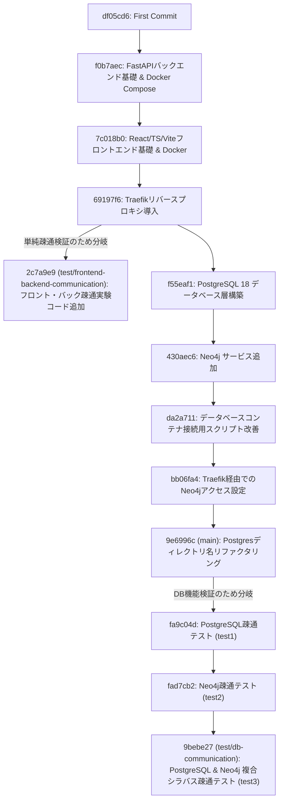

# ブランチ別機能・テスト検証内容まとめ (Branch Features & Test Verification Summary)

本プロジェクト（course-navigator）における主要ブランチ（`main`、`test/frontend-backend-communication`、`test/db-communication`）の役割、実装されている機能、および検証されているテスト内容について詳細に解説します。

---

## 1. 全体像とブランチ派生ツリー

リポジトリ内のコミット履歴および各ブランチの関係性は以下の通りです。

---

## 2. 各ブランチの機能とテスト検証内容

### 2.1. `main` ブランチ (基盤インフラスタック)

#### 役割と機能
システム全体の「骨組み（マルチコンテナのインフラ構造）」を提供する基本ブランチです。アプリケーションの具体的なビジネスロジックは最小限に留め、各サーバーおよびデータベースを Traefik リバースプロキシを介して協調動作させる環境の確立を主目的としています。

* **フロントエンド基盤**: React (v19) + TypeScript (v6) + Vite (v8) の開発コンテナ環境。
* **バックエンド基盤**: FastAPI をパッケージマネージャー `uv` を使用して管理するコンテナ環境。
* **プロキシ層**: Traefik v3.6 によるコンテナ間の名前解決およびルーティング制御。
* **データベース層**: PostgreSQL 18 (アルパイン版) および Neo4j 5.26 (LTS) のコンテナ定義。

#### テスト・検証内容
* **マルチコンテナのオーケストレーション検証**:
  * 共通ネットワーク `gateway` を介して、複数サービス（リバースプロキシ、DB、フロント、バック）が相互に干渉せず安定して起動すること。
  * `cource-navigator.localhost` ドメインから、Traefik を介してフロントエンド（`/`）およびバックエンド（`/api`）へ適切なポート（`5173`, `8000`）にトラフィックがルーティングされること。

---

### 2.2. `test/frontend-backend-communication` ブランチ

#### 役割と機能
プロキシ導入直後の初期フェーズにおいて、**フロントエンドとバックエンドの2者間での HTTP 通信が正しく確立できるか** を確認するための最もシンプルな疎通テストを実装したブランチです。

> [!NOTE]
> このブランチは初期段階（データベース層が main に追加される前）に分岐したため、PostgreSQL や Neo4j などの DB 関連設定やコンテナ定義は含まれていません。

#### テスト・検証内容
1. **GET 疎通テスト (`/api/data`)**:
   * バックエンドがダミーのリストデータを JSON 形式で返却し、フロントエンド側がそれをフェッチして画面にリスト表示できるかを検証。
2. **POST 疎通テスト (`/api/process`)**:
   * フロントエンドの入力フォームに入力された英字テキストをバックエンドに送信。
   * バックエンド側でテキストを大文字に変換して返却し、フロントエンド側にリアルタイムで結果を描画するインタラクティブな疎通を検証。
3. **目的**:
   * Traefik がバックエンドへのアクセス（`/api/*`）を受信した際、プレフィックス `/api` を正しくストリップしてバックエンドの FastAPI（`8000` ポートの `/` 配下）に転送できているかを検証。

---

### 2.3. `test/db-communication` ブランチ (高度なハイブリッドデータベース連携)

#### 役割と機能
`main` ブランチに統合されたデータベースインフラを活用し、実際に **PostgreSQL および Neo4j に対してデータの読み書き・検索をフロントエンドUIから実行する** 応用的な機能検証用のブランチです。React アプリに `react-router-dom` を導入し、画面遷移を伴う 3 つの疎通実験ページ（`/test1`, `/test2`, `/test3`）を構築しています。

#### テスト・検証内容

#### ① PostgreSQL単体疎通テスト (`/test1` パス)
* **バックエンド実装**:
  * 非同期 PostgreSQL クライアント `asyncpg` を用いた接続プールの制御。
  * アプリケーション起動時（lifespan イベント内）での `test_postgres` テーブルの自動生成処理。
  * `POST /test/postgres` (データ登録) および `GET /test/postgres` (あいまいキーワード検索) のエンドポイント。
* **検証内容**:
  * 講義データ（講義名・概要）をフォームから PostgreSQL へ永続化し、即時に検索結果一覧へ非同期反映されるかのトランザクション検証。

#### ② Neo4j単体疎通テスト (`/test2` パス)
* **バックエンド実装**:
  * Bolt プロトコルによる Neo4j グラフデータベースへのクエリ実行。
  * 講義名、カテゴリー等のノード作成と、それらのリレーション（前提関係、関連関係など）を定義するクエリ制御。
* **検証内容**:
  * グラフ構造におけるノード（Node）およびエッジ（Relationship）の動的な作成と、グラフ表現に耐えうるデータ整合性の確認。

#### ③ PostgreSQL × Neo4j 複合シラバス疎通テスト (`/test3` パス)
本プロジェクトの核心である「シラバスの構造化データ検索」と「履修系統（グラフ）のロードマップ検索」を組み合わせた**ハイブリッド検索**の技術検証です。

* **自動バリデーションと同期**:
  * 新しいシラバス（教員、曜日、単位、概要、トピック、前提講義コードなど）を登録する際、前提講義コードに未登録のものがある場合、PostgreSQL と Neo4j の両方に自動で「プレースホルダー」のノード/レコードを同期作成します。これにより、グラフの関係性（参照整合性）が壊れない仕組みをテストしています。
* **統合クエリ (ハイブリッド検索)**:
  * ユーザーがキーワード入力によるあいまい検索を実行すると、まず **PostgreSQL** から合致するシラバスレコードを高速に部分一致検索します。
  * その結果として得られた講義群のコードを元に、**Neo4j** に対して `UNWIND` クエリを実行。「対象講義に必要な前提履修のツリー構造（ロードマップ）」および「共通のトピックタグを有する関連講義」をグラフデータベースから一括で取得し、マージしてフロントエンドに返却します。
* **UI上での可視化検証**:
  * フロントエンド上の `IntegratedTest.tsx` において、シラバス詳細データ、矢印で連結された「前提履修ロードマップ」のフロー表示、および共通トピックに基づいた「関連講義の推薦サジェストカード」が動的かつ正確にレンダリングされることをテスト。

---

## 3. まとめと今後の設計への示唆

本プロジェクトが最終的に採用する **「PostgreSQL と Neo4j の 2データベース構成（ChromaをNeo4jに統合し、Neo4jがGraphとVectorの双方を表現する）」** に向けて、テストブランチで得られた検証結果は以下のように活用されます。

1. **データベース構成の適正化 (ChromaのNeo4jへの統合)**:
   * 当初想定されていた「Chroma (VectorDB) ＋ Neo4j (GraphDB) ＋ PostgreSQL (RDB)」という3層のデータベース構成から、Chroma を Neo4j に統合することで、**「Neo4j (Graph + Vector) ＋ PostgreSQL (RDB)」の2大データベース構成**へと整理されます。
   * これにより、管理するコンテナ数を減らしつつ、Neo4j の強力なベクトルインデックスと Cypher クエリを用いた、高度な GraphRAG の推薦システムが実現可能になります。
2. **PostgreSQL と Neo4j の協調動作の進化**:
   * `test/db-communication` の `test3` で検証された「PostgreSQL（構造化メタデータ・スケジュール属性等）」と「Neo4j（関係性・ベクトル・トピック）」の双方向の同期およびバリデーションロジックは、この2DB連携構成における安定運用のための重要な技術的基盤となります。
3. **ハイブリッド GraphRAG の実現**:
   * `test3` で実証された「前提履修関係（Neo4j）」と「スケジュール・講義属性（PostgreSQL）」のハイブリッド検索パターンは、Neo4j側のベクトル検索能力と組み合わせることで、実用的な推薦アルゴリズムとして高度に発展させることができます。
