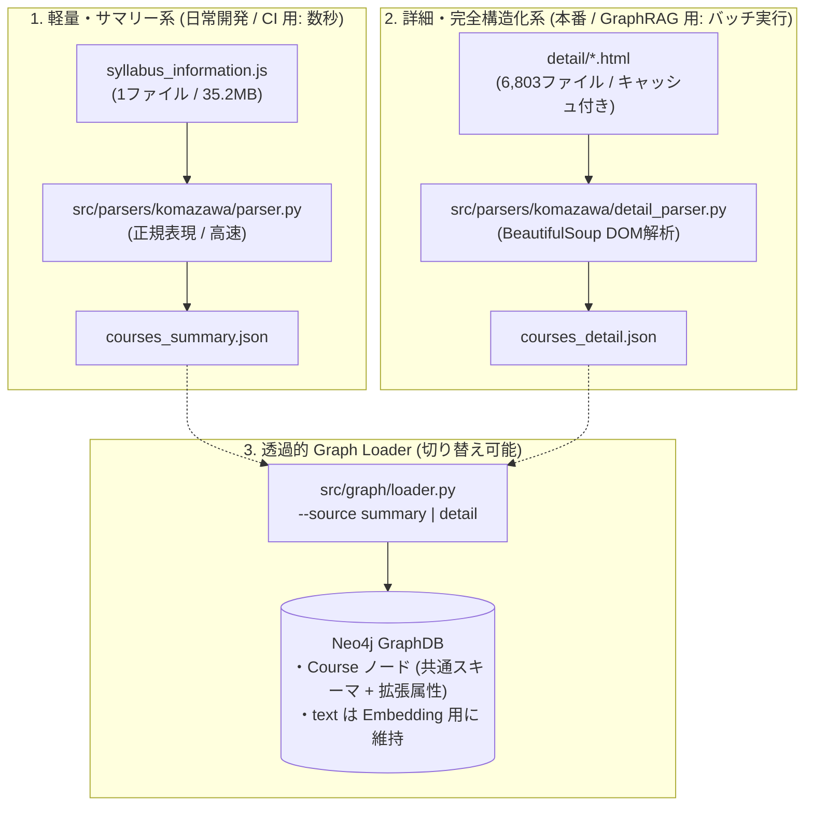

# [ADR-0013] シラバス情報パーサーにおけるサマリー版・詳細版の2系統アーキテクチャとスキーマ互換設計

- **ステータス**: 提案中 (Proposed)
- **起票日**: 2026-10-10
- **決定者 / 議論の場**: yuto (@cyanosome)
- **関連リンク**: [ADR-0002](0002-use-polyglot-persistence-postgres-and-neo4j.md), [ADR-0008](0008-refactor-uv-workspace-and-separate-ingestion.md), [ADR-0011](0011-pivot-from-nagasaki-to-komazawa-ingestion.md), `ingestion/README.md`, `ingestion/src/parsers/komazawa/parser.py`, `ingestion/src/graph/loader.py`

---

## 1. 背景と課題 (Context & Problem Statement)

- **現行サマリー版パーサー（`syllabus_information.js`）の実績と限界**
  - ADR-0011 に基づき駒澤大学データへのピボットを実施し、`syllabus_information.js`（静的インデックス全 6,803 科目）から開講期・単位数・開講コマ等の基本メタデータを抽出し、約 8.6 秒で Neo4j へ初期投入するパイプライン（`src/parsers/komazawa/parser.py`, `src/graph/loader.py`）を確立した。
  - しかし、実際のシラバス詳細 Web 画面を手動調査した結果、Web 上には「アクティブラーニング形態」「授業計画（第1〜30回）」「教科書・参考書」「成績評価割合テーブル（定期試験、レポート、小テスト、平常点等）」「到達目標」「履修上の留意点」といった豊富な構造化情報が存在することが確認された。
  - 一方、`syllabus_information.js` 内の `subject` 文字列は、詳細 HTML のテーブルセル値のみを空白区切りで機械的に結合したものであり、**HTML テーブルの見出しタグ（`<th>`）やデリミタ（区切り記号）が完全に脱落している**。
  - このため、`subject` 文字列から「成績評価数値（例: `60% 10% % 30%`）の項目名特定」や「教科書・留意点・到達目標の境界切り出し」を正規表現等のルールベースで行うことには情報科学的な限界（誤抽出・列ズレ・境界誤認）がある。
- **詳細 HTML 一括取得に伴う実行コストとサーバー負荷**
  - 構造化の完全性を期すためには、個別詳細 HTML（`detail/{rishu_code}.html`）を全件取得して DOM 解析を行う必要がある。
  - しかし、全 6,803 件の個別 HTML をスクレイピングする場合、大学サーバーへの負荷配慮（レートリミット: 0.5 秒ウェイト等）により取得だけで約 1 時間を要し、DOM 解析や全量投入も計算量・リソース消費が増大する。
  - これを必須化してしまうと、開発者のローカル開発サイクルや CI（GitHub Actions）における高速な通電テスト・E2E 検証が極度に遅延する。

---

## 2. 決定の判断基準 (Decision Drivers)

- **構造化の完全性と決定論的パース**: 成績評価割合や授業計画を推測やヒューリスティクスに頼らず、100% 正確に抽出できること。
- **開発・CI サイクルの俊敏性（Speed & Agility）**: 単体テストや E2E 検証において、数秒〜十数秒でパイプライン全体を実行できる軽量環境を維持すること。
- **大学外部サーバーへの負荷抑制とマナー**: 大量スクレイピングによる DoS 攻撃リスクや IP ブロックを回避し、安全に実行できること。
- **GraphRAG / ベクトル検索との整合性**: スキーマ細分化後も、検索や Embedding に必要な統合テキスト（`text`）プロパティを維持し、探索精度を落とさないこと。
- **スキーマの互換性と透過的ロード**: サマリー版・詳細版のどちらの出力 JSON からでも同一または透過的なインターフェースで Neo4j / PostgreSQL へ投入できること。

---

## 3. 検討した選択肢 (Considered Options)

1. **選択肢 A: 現行の JS `subject` 生文字列からの詳細正規表現パース一本化案**
   - 詳細 HTML の取得は行わず、`subject` 文字列からアドホックな正規表現を用いて授業計画や教科書、評価項目を切り出す。
2. **選択肢 B: 個別詳細 HTML パイプラインへの全面置換（詳細一本化）案**
   - 現行の JS パイプラインを廃止し、常に 6,803 件の個別詳細 HTML を収集・DOM パース・ロードする設計に統一する。
3. **選択肢 C: サマリー版（JS）と詳細版（HTML）の 2 系統パイプラインおよび透過的スキーマ互換設計の採用 【採用】**
   - サマリー版（高速・軽量、日常開発/CI用）と詳細版（完全構造化、本番/本格GraphRAG用）の 2 系統のパーサーを用意する。
   - 基底 Pydantic スキーマ（`CourseBase`）と Cypher の `coalesce` 活用により、どちらの JSON からでも DB ロードを切り替え可能（`--source summary|detail`）にする。
   - `text`（統合テキスト）は廃止せず維持し、詳細プロパティと両立させる。

---

## 4. 決定事項と選定理由 (Decision & Rationale)

**採用**: **選択肢 C: サマリー版と詳細版の 2 系統パイプラインおよび透過的スキーマ互換設計の採用**

### 選定理由

1. **俊敏性と品質の完全両立**:
   - 日常的な開発、CI、Agent との対話検証ではサマリー版（`courses_summary.json`、投入約8秒）を使用し、本番投入や詳細なシラバス分析では詳細版（`courses_detail.json`）を使用するという柔軟な運用が可能になる。
2. **生文字列の限界の受容と棲み分け**:
   - `subject` 文字列から無理に授業計画や教科書を正規表現で切り出そうとすると、教員の記述揺れによりコードが泥沼化する。サマリー版では「確実に取れる共通メタデータ + 評価割合数値列」にとどめ、詳細解析は DOM ツリーが保持されている HTML パーサーに任せることで、責務の分離とコードの堅牢性を担保できる。
3. **GraphRAG / ベクトル検索の品質保護（`text` プロパティの維持）**:
   - 詳細版でプロパティを細分化（`description`, `objectives`, `plans`, `notes`）した場合でも、それらを改行で整形結合した `text` プロパティを保持する。これにより、Neo4j の Vector Index / Full-text Index や LLM コンテキスト生成のインターフェースを変更することなく、高品質な検索が可能になる。
4. **ローダーとデータ契約の単一化**:
   - Pydantic モデルの継承（`CourseBase`）と Cypher の `coalesce` を用いることで、サマリー版・詳細版のどちらのデータが入力されても同一の Loader ロジックで安全に MERGE 投入できる。

---

## 5. 各選択肢の評価 (Pros & Cons)

### 選択肢 A: JS `subject` からの詳細正規表現パース一本化案

- **メリット (+)**:
  - 新たな HTML ダウンロード処理が不要。
- **デメリット・見送り理由 (-)**:
  - 見出しタグ（`<th>`）やデリミタが欠落しているため、成績評価の項目名マッピングや各セクションの境界判定が破綻し、品質の保証ができない。

### 選択肢 B: 詳細 HTML パイプラインへの全面置換（詳細一本化）案

- **メリット (+)**:
  - パーサーコードが 1 系統に集約される。
- **デメリット・見送り理由 (-)**:
  - 毎回 6,803 件の HTML を相手にするため、単体テストや CI での実行が非常に重くなる。
  - 初回取得時に約 1 時間を要し、開発の手離れが悪化する。

### 選択肢 C: サマリー版と詳細版の 2 系統パイプライン案 【採用案】

- **メリット (+)**:
  - 開発速度（数秒で回るサマリー版）とデータ精度（100% 構造化できる詳細版）の双方の利点を享受できる。
  - スキーマ継承により、既存コードや下流の API/UI への破壊的変更を最小限に抑えられる。
- **デメリット・受容するリスク (-)**:
  - パーサーおよび JSON 出力が 2 系統になるため、モデル定義の共通化・メンテナンスの規約化が必要となる（Pydantic 基底クラスで吸収）。

---

## 6. 影響と結果 (Consequences)

- **良い影響 (Positive)**:
  - 成績評価内訳（試験〇%、レポート〇%等）や各回授業計画、教科書・参考書の正確なグラフ化・DB 格納への道筋が確立される。
  - ローカル開発や CI を高速なサマリー版で保ちつつ、必要に応じて詳細版をビルドできる。
  - 下流の GraphRAG（Embedding）は `c.text` を介して両モード共通で動作できる。
- **留意点・トレードオフ (Negative / Neutral)**:
  - 詳細 HTML Fetcher には、大学サーバー負荷を回避するためのレートリミット（0.5秒ウェイト等）およびローカルキャッシュ（取得済み HTML のスキップ）の徹底が必須。
  - Neo4j にどこまで詳細を持たせるかについては、ADR-0002（Polyglot Persistence）に基づき、全 30 回の詳細計画テキスト等は PostgreSQL（JSONB）との棲み分けを検討する。
- **次のアクション (Next Actions)**:
  1. `src/parsers/komazawa/schema.py`: 基底モデル `CourseBase`、および `CourseSummary`, `CourseDetail` を定義。
  2. `src/parsers/komazawa/parser.py`: 現行サマリー版パーサーを微修正（`text` は維持しつつ、評価割合数値列 `evaluation_ratios` 等を安全に追加）。
  3. `src/fetchers/komazawa/fetch_details.py`: レートリミットとローカルキャッシュを備えた個別詳細 HTML Fetcher を新設。
  4. `src/parsers/komazawa/detail_parser.py`: BeautifulSoup による詳細 HTML DOM パーサーを新設。
  5. `src/graph/loader.py`: `--source summary|detail` オプションに対応し、共通 Cypher で透過投入できるように改修。

---

## 7. 参考資料 (References)

- [ADR-0002: PostgreSQL と Neo4j による Polyglot Persistence 構成の採用](0002-use-polyglot-persistence-postgres-and-neo4j.md)
- [ADR-0008: uv ワークスペース分割の試行とルート直下 Ingestion 分離への再編](0008-refactor-uv-workspace-and-separate-ingestion.md)
- [ADR-0011: 駒澤大学データへのピボット](0011-pivot-from-nagasaki-to-komazawa-ingestion.md)
- `ingestion/README.md`
