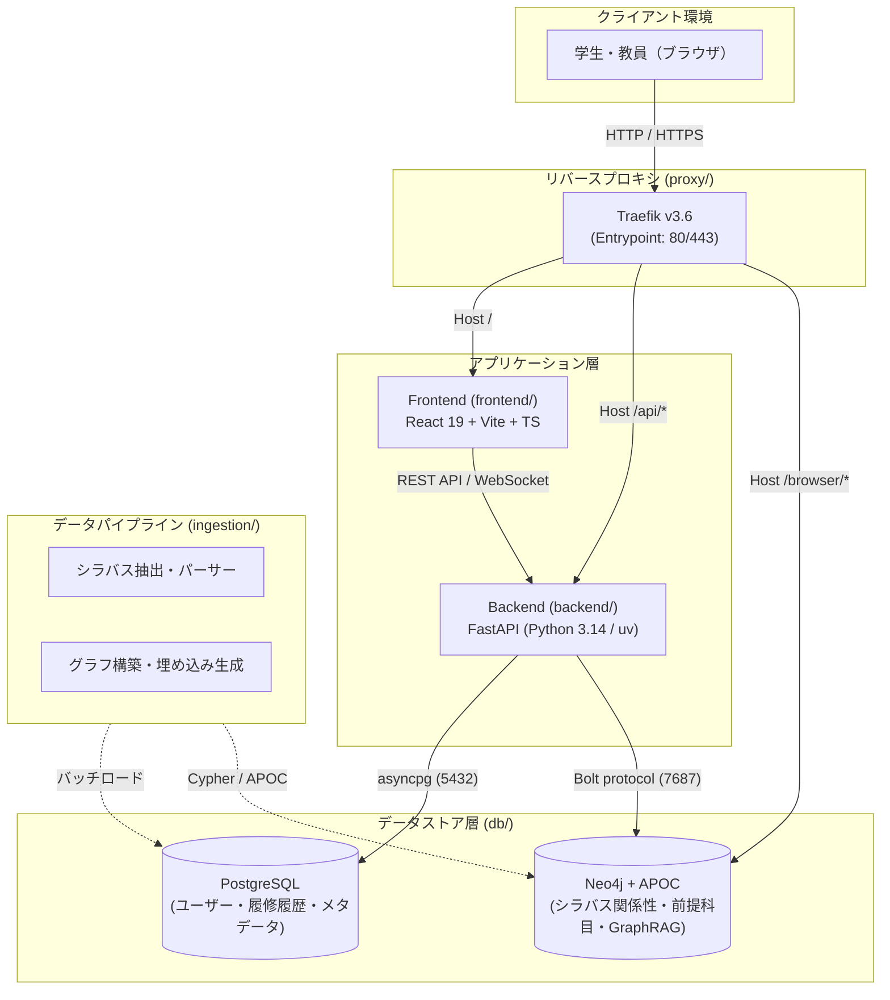
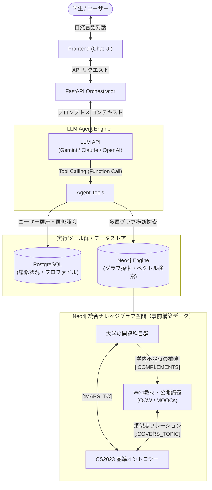
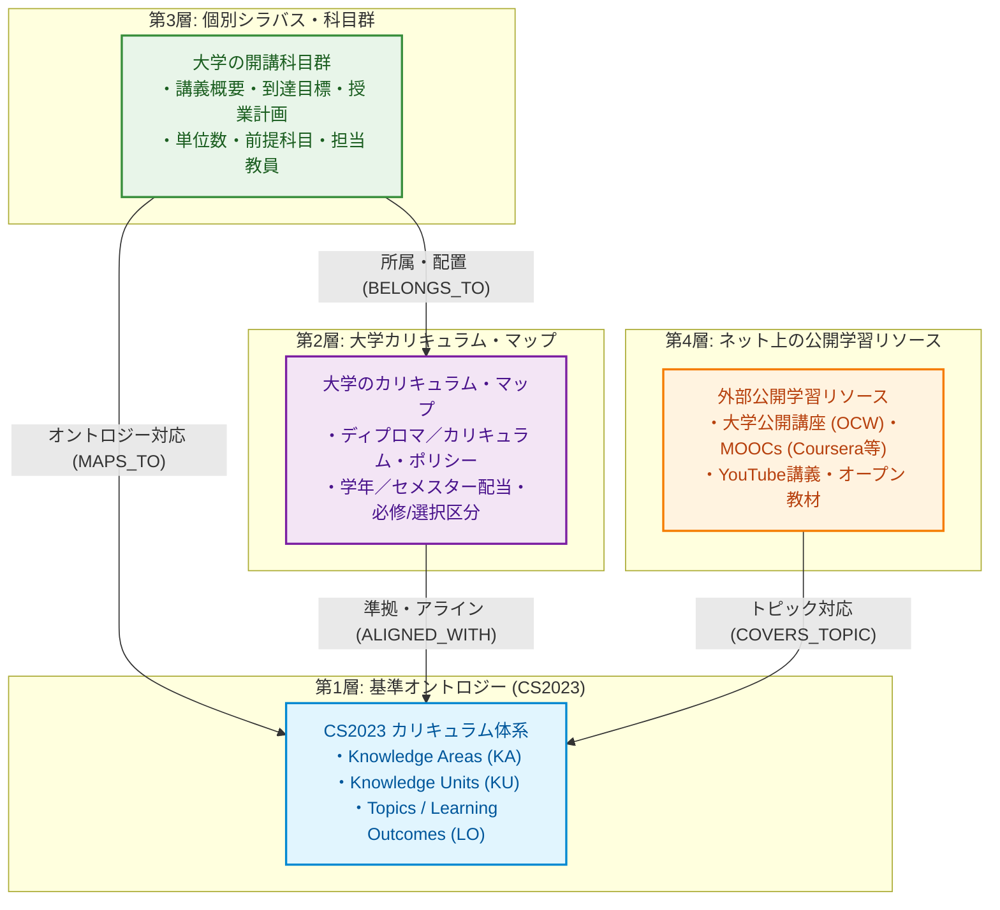
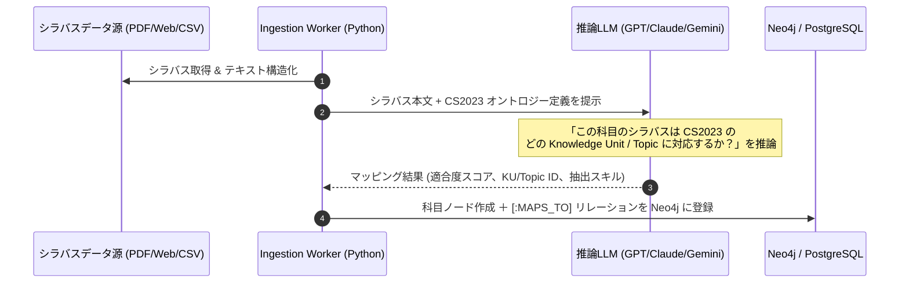

# システムアーキテクチャ概要 (Course Navigator)

本書は、「Course Navigator（大学の履修選択支援AI）」のシステム全体構成、各コンポーネントの責務、データフロー、および今後の展開アプローチを定義するドキュメントです。

---

## 1. 背景と目的 (Background & Objective)

### 1.1 背景と課題：なぜ学生は「防衛的な選択」に走るのか

- **学生の授業選びの重要性と不確実性**
  - 半期の生活リズムと学修の質を大きく決定づける極めて重要な意思決定であるにもかかわらず、多くの学生は「講義が面白いかどうか」「自分の学びたい方向性に合っているのか」を事前に明確に判断できていません。
- **「楽単」という防衛的選択（損失回避行動）**
  - 内容や難易度の不確実性が高い環境下では、学生は合理的に「失敗を避ける行動（損失回避）」を優先します。
  - その結果、「出席しなくてよい」「課題が少ない」といった、いわゆる「楽単」と呼ばれる科目が選ばれ、本来得られるはずだった知的好奇心や挑戦的な学びの機会が構造的に喪失されています。
- **「情報の不在」ではなく「探索の摩擦」と「専門知識の非対称性」**
  - 学生の手元に情報が届かないことと、大学側に情報が存在しないことは同一ではありません。シラバスをはじめとする公式情報はすでに網羅的に公開・蓄積されています。
  - 真の問題は「情報不足」ではなく、学生がそれらの専門的な記述を読み解き、活用する際に生じる **「探索の摩擦」** と **「専門知識の非対称性（カリキュラム全体を見通す知識を学生側が持っていないこと）」** にあります。
- **シラバスは「点」の情報**
  - 現行のシラバスは単一の科目ごとに独立した「点」の情報にとどまっており、学問分野の全体像を俯瞰することが極めて困難です。
  - 個々の講義が学問全体のどこに位置づけられ、自分の将来像や次の学修ステップにどう有機的に繋がるのかという **「線や面（文脈）」** が見えてきません。
  - 自身の将来やキャリアにおいて「なぜその授業を取るべきなのか」が見えないことが、選択の判断基準を「単位取得の容易さ」という防衛的な選択へと後退させる根本原因となっています。

---

### 1.2 本研究の目的とコアな主張

#### 【研究の目的】

大学における学問分野に対する **「知識の非対称性」を解消** し、学生が目先の負担軽減に偏重した防衛的選択から脱却し、**「学問体系と自己の将来像に基づいた自由で主体的な選択」** を可能にすること。

#### 【中心的な主張：点を繋ぐ新たなメディアの必要性】

学生が主体的に科目を選択するためには、学問分野の全体像の中でシラバスの科目がどこに位置し、自分の現在地から見てその手前や先で何を学ぶべきかを判定できなければなりません。

- **客観的な知識の地図（CS2023）**
  - ACM/IEEE CS2023 などの標準カリキュラム体系は、その学問分野で修得すべき知識構造を体系的に定義しています。
- **点を繋ぐメディアとしてのシステム**
  - 学生の選択の自由度を真に拡げるためには、**「学問分野全体の客観的な知識構造（地図）」** と **「大学の個々の授業（点）」** を有機的に接続する新たなメディアが必要です。
  - さらに、大学内の授業だけで満たせない学問領域については、学外のオンライン教材（OCW、MOOCs 等）で柔軟に補完できる枠組みを提供します。

---

### 1.3 コアアプローチ：客観的オントロジー × ナレッジグラフ × LLM Agent

本システム（Course Navigator）は、上記の課題を以下の3要素の統合によって解決します。

1. **CS2023 基準オントロジー**: 学問分野の客観的な知識構造を体系化し、全大学・全講義の共通座標軸とする。
2. **Neo4j による多層ナレッジグラフ**: 「知識体系（面）」「大学カリキュラム」「個別シラバス（点）」「外部教材」をリレーションで接続し、学習パスを可視化する。
3. **LLM エージェント**: 専門知識の非対称性と探索摩擦を解消し、学生の関心・将来像・前提知識に合わせて最適な学習線・履修パスを対話的に導き出す。

---

### 1.4 長期展望と本設計におけるスコープ

- **長期的な展望（全学問分野へのオントロジー展開）**
  - 本質的には、計算機科学に限らず、人文科学・社会科学・自然科学など、**大学で扱われるあらゆる学問分野に対してオントロジー構造を順次展開していくこと** が究極のビジョンです。学問全体の知識構造が地図化されれば、文理融合の横断的履修や副専攻の探索など、すべての学修者に対して普遍的な選択の自由を提供できます。
- **本設計におけるフォーカス領域（先行実証モデルとしての集中）**
  - 上記の長期展望に対し、CS2023 におけるマッピング行為はあくまでその **「前段（パイロット・先行実証）」** として位置づけられます。
  - そのため、本システムの現行設計・実装においてはスコープを絞り込み、国際標準として知識体系が極めて綿密に定義されている **「CS2023 に基づく情報系科目のオントロジーマッピング」** と、**「大学内に開講されていない・不足している科目を Web 上の公開教材（OCW / MOOCs 等）で補強する枠組み」** の2点に集中して実現を図ります。

---

## 2. システム全体構成図

---

## 3. コンポーネント構成と技術スタック

各コンポーネントは独立した Docker サービスとして分離され、共通の外部 Docker ネットワーク `gateway` を介して通信します。

| レイヤー             | ディレクトリ   | 主要技術スタック           | 役割・責務                                                                                                                                         |
| :------------------- | :------------- | :------------------------- | :------------------------------------------------------------------------------------------------------------------------------------------------- |
| **Proxy**            | `proxy/`       | Traefik v3.6               | ・全トラフィックの統一エントリポイント ・パス/ホストベースのルーティング (`/`, `/api`, `/browser`) ・TLS自動証明書管理 (Let's Encrypt対応)   |
| **Frontend**         | `frontend/`    | React 19, TypeScript, Vite | ・履修相談チャットインターフェース ・前提関係やスキルツリーの可視化 (インタラクティブグラフ) ・履修登録シミュレーション画面                  |
| **Backend**          | `backend/`     | FastAPI, Python >=3.14, uv | ・REST APIの提供 ・GraphRAGオーケストレーション（Neo4j Cypherクエリ生成 ＋ LLM連携） ・認証・ユーザーデータ管理                              |
| **Database (RDB)**   | `db/postgres/` | PostgreSQL 17              | ・ユーザー情報・認証情報 ・履修登録・お気に入り科目の履歴 ・シラバス等の構造化メタデータ                                                     |
| **Database (Graph)** | `db/neo4j/`    | Neo4j 5.x (APOC)           | ・科目・講義エンティティ ・前提科目（`REQUIRES`）や関連分野（`RELATED_TO`）のリレーション ・GraphRAGのためのグラフ探索・ベクトルインデックス |
| **Ingestion**        | `ingestion/`   | Python (uv)                | ・大学シラバスデータ (PDF, Webスクレイピング, CSV等) のパース ・LLMを用いた関係抽出とNeo4jへのバッチ書き込み                                    |

---

## 4. データストアの役割分担

### PostgreSQL (リレーショナル)

- **整合性重視のトランザクションデータ**:
  - ユーザーアカウント、プロファイル情報
  - 学生の取得済み単位、過去の履修履歴
  - お気に入り科目リスト、検討中カリキュラム

### Neo4j (グラフデータベース)

- **関係性重視の知識ベース (GraphRAG用)**:
  - ノード例: `(:Course)`, `(:Professor)`, `(:Topic)`, `(:Skill)`, `(:Department)`
  - エッジ例:
    - `(:Course)-[:PREREQUISITE_OF]->(:Course)` （前提条件）
    - `(:Course)-[:COVERS_TOPIC]->(:Topic)` （扱っている分野）
    - `(:Course)-[:TAUGHT_BY]->(:Professor)` （担当教員）
    - `(:Topic)-[:PART_OF]->(:Field)` （学問体系）

---

---

## 5. 将来構想とターゲットアーキテクチャ (To-Be)

本システムは単なるシラバス検索にとどまらず、**「LLM エージェント」** と **「国際標準オントロジー (CS2023) をハブとした多層知識基盤」** を中核に据えた自律型履修支援システムを目指します。

### 5.1 LLM エージェント型アーキテクチャ (Agentic Architecture)

FastAPI をオーケストレータとし、外部 LLM API（Gemini / Claude / OpenAI 等）と疎通して自律的なエージェント（Agent）として機能させます。エージェントは単一のテキスト生成ではなく、思考・計画（Planner）とツール実行（Tool Use）のループを通じて学生を支援します。

Web教材（OCW / MOOCs 等）についても、エージェントが都度外部Webを直接スクレイピングするのではなく、**事前に Ingestion パイプラインによって収集・ベクトル類似度計算され、Neo4j（GraphDB）内部で CS2023 などのオントロジー構造にリレーション接続された状態** で管理されます。エージェントは GraphDB 内を横断的に探索することで、大学内の科目と不足を補うWeb教材を同一の知識基盤から統一的に提案します。

#### エージェントが担う主要ツール

1. **`GraphKnowledgeQueryTool`**:
   - 質問内容や目標スキルに応じて、Neo4j に対する Cypher クエリ生成およびベクトル類似度探索を実行。
   - 大学科目だけでなく、**大学内に開講されていない領域を補完する Web 教材（事前グラフ化済み）もオントロジーのリレーションを辿って統合的に取得**。
2. **`CurriculumConstraintTool`**:
   - 大学固有の卒業要件、履修上限単位数、時間割の重複制約を検証。
3. **`UserProfileTool`**:
   - PostgreSQL から学生の既修得科目、興味関心、希望進路を取得し、エージェントの推論コンテキストに注入。

---

### 5.2 CS2023 基準オントロジーを中心とする多層データ構造

将来的な全学問分野へのオントロジー展開を見据えた **「先行実証モデル」** として、今回は大学ごとのシラバス表現の揺らぎを吸収し、汎用的な推薦を可能にする **ACM/IEEE CS2023 (Computer Science Curricula 2023)** を情報系分野の「基準オントロジー（Ground Truth）」として配置します。

大学内の科目と、学内では不足している領域を補うWeb公開教材を有機的に結びつけるため、システム全体で以下の **4層のデータ構造** を Neo4j 上で統合管理します。

#### 各層の責務

- **第1層 (CS2023 オントロジー)**:
  - 計算機科学の世界標準カリキュラム。不変の基準インデックスとして機能。
- **第2層 (大学カリキュラム・マップ)**:
  - 各大学が策定する履修モデル、専攻コース、卒業要件ルール。
- **第3層 (個別科目・シラバス)**:
  - 毎年更新される具体的な講義情報。シラバス本文からセマンティック抽出。
- **第4層 (外部公開学習リソース)**:
  - 「大学の開講科目」の枠を超え、独学や予習・復習をサポートする補完教材ネットワーク。

---

### 5.3 Ingestion パイプラインによるオントロジー自動推論マッピング

シラバスデータを取り込む（Ingestion）際、単なるテキスト保存ではなく、**LLM の意味理解能力を用いて各シラバスが CS2023 のどの知識領域に位置するかを推論・自動マッピング** します。

- **このアプローチの利点**:
  - 大学ごとに「情報数学」「離散構造」「計算理論基礎」など科目名が異なっていても、CS2023 の `AL/Discrete Structures` などの共通ノードに集約・関連づけられる。
  - 複数大学間のカリキュラム比較や、他大学・外部教材への代替推薦が自動的に可能になる。

---

---

## 6. ドキュメントの保守方針

- アーキテクチャの変更や新しい主要コンポーネントの追加時は、本ドキュメントを更新してください。
- 開発計画・実験項目・フェーズ詳細については、`roadmap.md`を参照してください。
- 重要な設計上の意思決定（例: LLM Frameworkの選定、CS2023以外のオントロジー拡張、認証方式など）は `docs/adr/` に Architecture Decision Records (ADR) として追記します。
- オントロジーやノード・エッジのプロパティ詳細定義は、追って `docs/data-model.md` に詳細化します。
