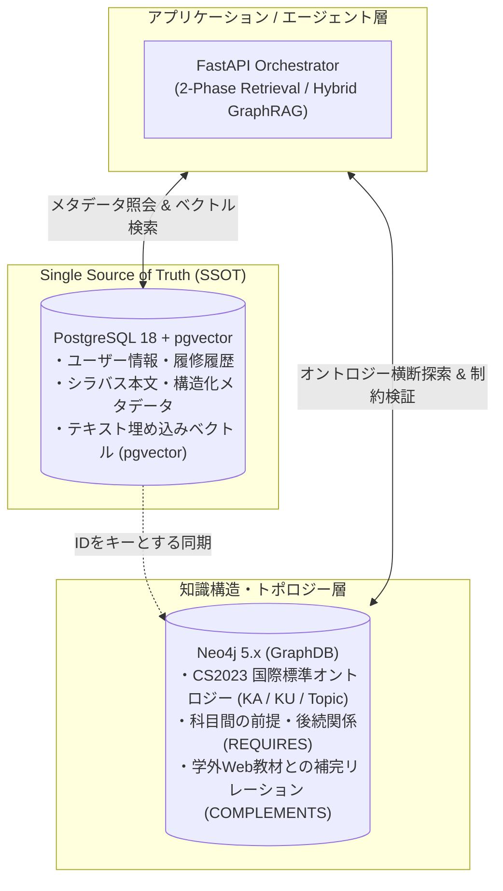

# [Experiment Plan] Vector vs GraphDB 比較検証・実験計画書

- **ステータス**: 計画中 (Draft / Ready for Implementation)
- **対象ブランチ**: `test/vector-graph-eval`
- **派生元ブランチ**: `test/agent-communication`
- **作成日**: 2026-10-08
- **関連ドキュメント**: [`docs/architecture.md`](../architecture.md), [`docs/roadmap.md`](../roadmap.md), [`docs/adr/0002-use-polyglot-persistence-postgres-and-neo4j.md`](../adr/0002-use-polyglot-persistence-postgres-and-neo4j.md)

---

## 1. 背景と目的 (Background & Objective)

### 1.1 背景
「Course Navigator（履修支援AI）」の研究・開発において、外部レビューより「Vector と GraphDB の2つについて比較実験を行う必要がある」という指摘を受けた。
本システムは単なるキーワード検索にとどまらず、**「ACM/IEEE CS2023 国際標準オントロジー」を共通座標（ハブ）とし、大学シラバスと学外Web公開教材（MOOCs等）を有機的に結びつける多層知識基盤**を指向している。

この目的を達成するにあたり、以下の根本的な技術的問いに答えるための比較検証実験を計画する。

1. 学生の興味・関心に基づく履修推薦において、**単なる類似度（Vector）検索のみで十分なのか**？
2. 多様なデータ層（オントロジー・カリキュラム・シラバス・外部教材）を扱うために**GraphDBを採用する技術的必然性（理由）はどこにあるのか**？
3. VectorDB（あるいはRDBのメタデータ）単体で多層構造を表現することは可能か、またその場合の技術的限界は何か？

---

## 2. コア設計思想：Truth of Data (SSOT) と多層オントロジー

本実験を設計する上で、プロジェクト全体のデータ設計思想を以下のように明確化する。



1. **Truth of Data (SSOT) は PostgreSQL**:
   - シラバスのマスターデータ、属性メタデータ（単位数・学期・担当教員）、および学生の履修トランザクションは PostgreSQL で一元管理する。
   - ベクトル検索で推論した場合も、得られた識別子（ID）をキーとして PostgreSQL から詳細メタデータを取得（Hydration）する。
2. **Neo4j はオントロジー構造（トポロジー）の再現に特化**:
   - Neo4j は「科目同士・オントロジー同士の深い関係性」を高速にトラバースするためのプロジェクション（射影）ストアとして位置づける。

---

## 3. 仮説の定式化と先行調査 (Hypotheses)

本実験では、以下の4つの仮説を検証対象とする。

### 仮説 1: 【Pure Vector / 意味空間縮約仮説】
> **「複雑な多層構造をわざわざモデル化しなくても、学生の要望テキストとシラバス本文のベクトル類似度検索（Cosine）だけで実用的な推薦が可能である。」**

- **予想される強み**:
  - 学生の曖昧な興味（例: 「自然言語処理の基礎を学びたい」）に対して、シラバスの語彙の揺らぎを吸収し、高い適合度（Relevance）で講義を推薦できる。
- **予想される破綻点（限界）**:
  - **制約充足の無視**: 前提科目（例: 線形代数、微積分）の履修状態を考慮できず、論理的に履修不可能な発展科目を推薦してしまう。
  - **カリキュラムギャップ（不在）の検出不能**: 「自大学に該当科目が存在しないため、MOOCsで補強する」という**構造的欠落の判定**ができない。

### 仮説 2: 【VectorDB + Metadata / 疑似多層仮説】
> **「専用GraphDBを導入せずとも、VectorDB（あるいは RDB + pgvector）のメタデータフィルタ（Payload Filtering）によって多層構造や前提条件を十分に表現できる。」**

- **予想される強み**:
  - 単一DB（PostgreSQL）内で完結し、インフラ構成がシンプルになる。
  - 学年配当やセメスターなどの1ホップの属性絞り込みであれば高速・高精度に動作する。
- **予想される破綻点（限界）**:
  - **多段ホップ（Multi-hop）の結合爆発**: 「科目Aの前提科目Bの、さらに前提科目C」や「Aが対応するトピック群と重複する外部教材群」を探索する際、アプリケーション側で多段階のクエリ（N+1問題）を発行・結合する必要があり、実装が複雑化しレイテンシが急増する。

### 仮説 3: 【GraphDB / 構造・トポロジー重視仮説】
> **「前提科目ツリーや学問体系オントロジーのトラバース、および学外教材の補完関係探索には、GraphDB（Cypher）によるトポロジー探索が不可欠である。」**

- **予想される強み**:
  - 履修ツリーの整合性（論理的妥当性）を100%保証できる。
  - CS2023オントロジーをハブとすることで、「大学科目がカバーしていないトピック」を検出し、そのノードに接続されたWeb教材（Coursera等）を自律的に推薦できる。
- **予想される弱点**:
  - 単純なキーワード検索のみに依存した場合、シラバス本文と完全一致しない概念や抽象的な興味を拾えない（表現力の欠如）。

### 仮説 4: 【GraphDB + Vector / ハイブリッド仮説 (提案手法)】
> **「ベクトル検索による柔軟な意味的エントリポイント特定と、GraphDBによる多層オントロジー探索・制約検証を統合することで、適合度・論理整合性・説明性のすべてが最大化される。」**

---

## 4. 比較対象とする4つの実験アプローチ

同一の評価用データセットおよび学生プロファイルに対して、以下の4手法を比較・評価する。

| 手法 | アーキテクチャ | 検索・推薦のメカニズム |
| :--- | :--- | :--- |
| **① Pure Vector** | PostgreSQL (`pgvector`) | クエリのEmbeddingとのコサイン類似度上位K件を抽出 |
| **② VectorDB + Metadata** | PostgreSQL (`pgvector` + SQL WHERE) | ベクトル類似度検索に加え、SQL条件（学年・学期・必修区分）でフィルタリング |
| **③ Pure Graph** | Neo4j (Fulltext / キーワード) | キーワードによる全文検索で起点ノードを取得し、Cypherで前提条件・トピックを展開 |
| **④ GraphDB + Vector**<br>(提案手法: ハイブリッド) | PostgreSQL (`pgvector`)<br>＋ Neo4j (Cypher) | ベクトル検索で興味に合致する科目・トピックを特定し、そのIDを起点にNeo4jで前提ツリー展開・カリキュラムギャップ（Web教材）補完を実行 |

---

## 5. インフラ環境とDB選定の批評 (Infra & DB Best Practices)

### 5.1 なぜ「Neo4jを単なるVectorDBとして代用する」構成を避けるべきか？
Neo4j 5.x には内蔵の Vector Index が備わっているが、Pure Vector や Vector+Metadata のベースライン評価に Neo4j を利用するのは、以下の理由から**学術的・技術的妥当性を欠く（不自然である）**:
1. **SSOTとの二重管理**: シラバスのTruth of DataはPostgreSQLにあるため、Neo4jにすべてのベクトル検索を依存させると二重同期のオーバーヘッドが生じる。
2. **評価の公平性**: 一般的なVectorRAGのベンチマークにおいて、グラフDBのアドオン機能（Neo4j Vector）を標準的なVectorDBの代表として扱うことはレビュアーから疑問視されるリスクが高い。

### 5.2 採用するベストプラクティス: PostgreSQL + `pgvector`
本プロジェクトでは、業界のデファクトスタンダードに従い、**既存の PostgreSQL コンテナに公式拡張 `pgvector` を導入**する。

```dockerfile
# db/postgres/Dockerfile の変更方針
# FROM postgres:18.4-alpine3.24
FROM pgvector/pgvector:pg18
```

#### この構成の技術的メリット
- **SSOTとの完全同居 (Zero Overhead)**: シラバス詳細とEmbeddingが同一DB内に存在するため、ID引き当て通信が不要。
- **HNSWインデックス**: `pgvector` v0.7+ により、専用VectorDBに匹敵する高速な近似最近傍探索（ANN）が可能。
- **インフラ構成の最小差分**: Dockerfileのベースイメージを差し替えるのみで、コンテナ数を増やすことなく最高水準のVectorRAG基盤が整う。

---

## 6. 実験の評価指標 (Evaluation Metrics)

| 評価軸 | 指標 / 測定方法 | 評価する問い |
| :--- | :--- | :--- |
| **① 適合度 (Retrieval Quality)** | NDCG@K, Recall@K, LLM-as-a-Judge | 学生の抽象的・意味的な興味関心を正しく捉えた講義が抽出できているか？ |
| **② 制約充足度 (Constraint Satisfaction)** | 前提科目充足率 (0.0〜1.0)<br>履修順序違反件数 | 推薦された科目の中に、未履修の前提科目を無視した講義が含まれていないか？ |
| **③ 構造的補完性 (Gap Coverage)** | 未開講トピックの外部教材充足率 | 大学にない領域について、客観的オントロジーを経由して適切なWeb教材を補完できているか？ |
| **④ 説明性 (Explainability)** | 根拠パス（Path）の提示有無 | 「なぜその科目が推奨されたか」をカリキュラム系統樹として明示できているか？ |
| **⑤ 処理性能・複雑性 (System Performance)** | レイテンシ (ms), クエリ数 (N+1の有無) | 多段階の探索を行った際の実用的な応答時間と実装のシンプルさ。 |

---

## 7. 実装・検証のステップ (Execution Plan)

1. **基盤整備 (Branch: `test/vector-graph-eval`)**:
   - `test/agent-communication` から `test/vector-graph-eval` ブランチを作成。
   - `db/postgres/Dockerfile` を `pgvector/pgvector:pg18` に移行し、`CREATE EXTENSION vector;` を適用。
2. **データ取り込み (Ingestion)**:
   - シラバスのテキストからEmbedding（OpenAI API / FastEmbed等）を生成し、PostgreSQLの `course_embeddings` テーブルに格納。
   - 同時に、科目間の前提条件およびCS2023トピックとの関連エッジを Neo4j に投入。
3. **比較用検索インターフェースの実装**:
   - バックエンドに 4つの検索モード（`pure_vector`, `vector_metadata`, `pure_graph`, `hybrid`）を切り替えて実行できる実験用エンドポイント/評価スクリプトを実装。
4. **評価実験の実施と結果まとめ**:
   - 複数の典型的な学生ペルソナ（クエリセット）を流し込み、定量・定性データを収集。
   - 本ドキュメントに結果を追記し、最終的な設計決定を ADR（例: `[ADR-0012]`）として記録する。
