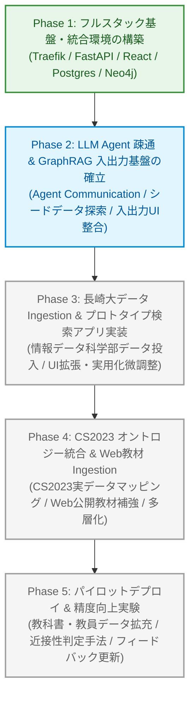

# 研究・開発ロードマップ (Course Navigator Roadmap)

本書は、「Course Navigator」プロジェクトの研究・開発フェーズ、実験計画、および将来の機能拡張ロードマップを定義するドキュメントです。

---

## 1. プロジェクト理念と運用情報

### 定例ミーティング

- **開催日時**: 毎週水曜日 20:00〜21:00（最大23:00まで延長可）
- **タイムゾーン**: Asia/Tokyo
- **ビデオ通話リンク**: [Google Meet](https://meet.google.com/zca-atth-zoh)

### 非営利プロジェクト方針

本プロジェクトは **非営利の学術研究目的** で実施されます。

- API 利用料金等の運用コストと相殺できるような持続可能な運用枠組みを目指します。
- 万が一、プロジェクト活動を通じて利潤が発生した場合は、関与したメンバーの所属大学（卒業済みの場合は出身大学）に研究振興費として均等に寄付します。大学在籍経験がないメンバーがいる場合は一般社団法人情報処理学会へ寄付します。

---

## 2. フェーズ別全体像 (Overview)

---

## 3. 各フェーズの詳細と実験項目

### Phase 1: フルスタック基盤・統合環境の構築 【完了】

- **目的**: Docker Compose と Traefik を用いて、Web（Backend/Frontend）および複合DB（PostgreSQL, Neo4j）の開発環境を整備し、全コンテナ間の双方向疎通を確立する。
- **実施内容**:
  - [x] Traefik v3.6 リバースプロキシによるドメイン・パスルーティングの確立 (`/`, `/api`, `/browser`)
  - [x] FastAPI (Python 3.14 / uv) と React 19 (Vite + TypeScript) のコンテナ構築
  - [x] PostgreSQL (asyncpg 接続プール) と Neo4j (APOC プラグイン導入・Bolt 接続) の初期化基盤実装
  - [x] Backend ⇄ PostgreSQL / Neo4j へのテストクエリ疎通完了

---

### Phase 2: LLM Agent 疎通 & GraphRAG 入出力基盤の確立 【進行中】

_（ブランチ: `test/agent-communication`）_

- **目的**: ユーザー側のデータ **Input（履修希望・条件・自然言語での対話）** と **Output（履修プラン提案・グラフ探索結果・UI表示）** のインターフェース整合性を最優先で確立する。シードデータやダミーデータを活用し、Agent と GraphRAG のエンドツーエンドのパイプラインを先行して成立させる。
- **実験項目**:
  - **実験 2-1: Agent 疎通とワークフロー構築（ADK / FastAPI 連携）**
    - LLM API と Backend を連携させ、ユーザーの入力に応じたプロンプト管理およびエージェントの思考・ツール呼び出しワークフローを構築。
  - **実験 2-2: Neo4j MCP / Cypher 生成ツールの検証**
    - LLM が自然言語の履修相談から適切な Cypher クエリを発行し、Neo4j から前提条件ツリーや関連講義を取得できるかを検証。
  - **実験 2-3: 静的エージェント (static_agent) による入出力 UI 疎通テスト**
    - 20件程度のシードデータ（講義情報・履修系統図）をもとに、Frontend の対話 UI と Backend Agent 間でデータ Input/Output が正確に送受信・可視化されるかを確認。
  - **実験 2-4: カリキュラム制約統合推論 (Constraint Integration)**
    - 大学の履修上限単位数や時間割重複を考慮し、エージェントが制約を遵守した提案を出力できるか検証。

---

### Phase 3: 長崎大学データ Ingestion & プロトタイプ検索アプリ実装 【未着手 / 次期フェーズ】

_（方針決定: MTG 09/09）_

- **目的と選定背景**:
  - 最速で実際にユーザーが利用可能なプロトタイプを成立させるため、Phase 2 の完了後、**長崎大学 情報データ科学部のカリキュラムマップおよび開講科目群** のみを対象として Ingestion を作成する。この段階では CS2023 とのマッピングは行わず、即座にプロトタイプ検索アプリとして動く状態へ到達させるとともに、Frontend の拡張・ユーザー利用のための微調整を完了させる。
  - **長崎大学を対象とする理由**: 開発メンバーの1名が長崎大学 情報データ科学部所属の学生であり、学内のプログラミングサークルに所属している。そのため、シラバスやカリキュラム構造の解像度が高く、かつ完成したプロトタイプをサークル員や同学部の学生へ迅速に展開し、**学生レベルでの実運用テストと生の声（一次情報）の収集が極めて容易に行える実践的な環境** が整っているため。
- **主なタスク・実験項目**:
  - **実験 3-1: 長崎大学 情報データ科学部 シラバス & カリキュラムの Ingestion**
    - 学部のカリキュラム系統図および開講科目のシラバスデータを収集・抽出し、Neo4j / PostgreSQL に登録。
  - **実験 3-2: 実データに基づく GraphRAG 検索・推論の結合**
    - Phase 2 で構築した Agent 基盤を実データに接続し、実シラバスとカリキュラムマップに基づく履修推薦の動作を検証。
  - **タスク 3-3: Frontend の拡張とユーザー向け微調整**
    - 学生が実際に利用できるよう、チャット UI の洗練、検索結果・推薦科目の詳細表示、前提科目ツリーの表示補助など、操作性を高める UI/UX の拡張を実施。
  - **実験 3-4: 学生インタビュー実験（定性評価）**
    - 所属サークルおよび学部の学生を対象にプロトタイプを実際に試用してもらい、対面/オンラインでのインタビュー実験を実施。
    - 「従来のシラバス検索と比べて履修判断の納得感や探索摩擦がどう変化したか」「目先の負担軽減に偏重した防衛的選択から、関心に基づいた選択に寄与できたか」を定性的に検証し、Phase 4（CS2023 オントロジー統合）に向けた改善フィードバックを得る。

---

### Phase 4: CS2023 基準オントロジー統合 & Web教材 Ingestion 【未着手】

- **目的**: 単一大学でのプロトタイプ成立後、本来の目標である **国際標準 ACM/IEEE CS2023 オントロジー** を Neo4j に投入。長崎大学の科目をオントロジーへ自動マッピングし、さらに学内でカバーできない領域を補完する学外 Web 公開教材（OCW / MOOCs 等）を取り込んで多層ナレッジグラフを完成させる。
- **主なタスク・実験項目**:
  - **実験 4-1: CS2023 オントロジーのグラフモデリングと投入**
    - KA / KU / Topic / LO の階層ノードを Neo4j に投入。
  - **実験 4-2: LLM による学内科目 ↔ CS2023 オントロジーの自動推論マッピング**
    - 長崎大学のシラバス内容から、LLM を用いて CS2023 のどの知識領域・トピックに対応するかを推論し、自動リンク (`[:MAPS_TO]`) を構築。
  - **実験 4-3: 外部公開 Web 教材の収集とオントロジーマッピング**
    - 大学公開講座 (OCW) や MOOCs を収集し、CS2023 のトピックに事前グラフ化して接続（大学内にない科目の補強）。
  - **タスク 4-4: プロダクト機能の本格拡充**
    - 時間割 Wishlist シミュレータ、アカウント・履修履歴管理、ナレッジマップ全体のインタラクティブ可視化。

---

### Phase 5: パイロットデプロイ & 検索生成の高度化・精度向上実験 【未着手】

- **目的**: 実際の大学環境へデプロイして学生・教員からフィードバックを収集し、検索・生成ロジックの精度向上を継続的に行う。
- **実験項目**:
  - **実験 5-1: シラバス教科書・レビュー情報のグラフ追加**
    - 教科書情報や書籍レビュー、推薦図書データをグラフに追加し、講義の実質的難易度や内容の解像度を高めた推薦精度の向上を検証。
  - **実験 5-2: 教員実績・研究分野情報の追加**
    - 担当教員の研究分野や過去の実績データをナレッジグラフに統合し、教員の専門性と講義の結びつきによるマッチング精度を検証。
  - **実験 5-3: グラフ近接性・マッピング判定手法の比較**
    - 科目間の関連度判定において、ベクトル類似度（Cosine）、トピック共起、およびグラフ構造距離（PageRank / 最短経路）の精度比較実験を実施。
  - **実験 5-4: ユーザーフィードバックによる自動適応 (Active Learning)**
    - 履修相談結果に対するユーザーの満足度や選択結果をフィードバックとして蓄積し、推薦重みやプロンプトを自動更新する手法の実現可能性を検証。

---

## 4. 進捗・タスク管理方針

- **長期目標・実験計画**: 本ドキュメント (`docs/roadmap.md`) で全体像を管理します。
- **日々のタスク・Issue**: GitHub Projects および GitHub Issues にブレークダウンし、コミットやプルリクエストと連動させて進捗を追跡します。
