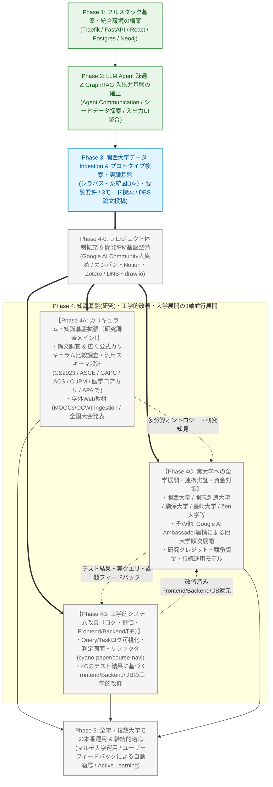

<!-- AUTO-GENERATED FILE: DO NOT EDIT DIRECTLY. Edit files under docs/roadmap/ and run `python docs/roadmap/build.py`. -->

# 研究・開発ロードマップ (Course Navigator Roadmap)

本書は、「Course Navigator」プロジェクトの研究・開発フェーズ、実験計画、および将来の機能拡張ロードマップを定義するドキュメントです。

---

## 1. プロジェクト理念と運用情報

### 定例ミーティング

- **開催日時**: 毎週水曜日 20:00〜21:00（最大23:00まで延長可）
- **タイムゾーン**: Asia/Tokyo
- **ビデオ通話リンク**: [Google Meet](https://meet.google.com/zca-atth-zoh)

### 非営利プロジェクト方針

本プロジェクトは **非営利の学術研究目的** で実施されます。

- API 利用料金等の運用コストと相殺できるような持続可能な運用枠組みを目指します。
- 万が一、プロジェクト活動を通じて利潤が発生した場合は、関与したメンバーの所属大学（卒業済みの場合は出身大学）に研究振興費として均等に寄付します。大学在籍経験がないメンバーがいる場合は一般社団法人情報処理学会へ寄付します。

---

## 2. フェーズ別全体像 (Overview)

```mermaid
flowchart TD
    P1["Phase 1: フルスタック基盤・統合環境の構築<br/>(Traefik / FastAPI / React / Postgres / Neo4j)"]
    P2["Phase 2: LLM Agent 疎通 & GraphRAG 入出力基盤の確立<br/>(Agent Communication / シードデータ探索 / 入出力UI整合)"]
    P3["Phase 3: 関西大学データ Ingestion & プロトタイプ検索・実験基盤<br/>(シラバス・系統図DAG・要覧要件 / 3モード探索 / DBS論文投稿)"]

    P4_0["Phase 4-0: プロジェクト体制拡充 & 開発/PM基盤整備<br/>(Google AI Community人集め / カンバン・Notion・Zotero / DNS・draw.io)"]

    subgraph Phase4Parallel ["Phase 4: 知識基盤(研究)・工学的改善・大学展開の3軸並行展開"]
        direction TB
        P4A["【Phase 4A: カリキュラム・知識基盤拡張（研究調査メイン）】<br/>・論文調査 & 広く公式カリキュラム比較調査・汎用スキーマ設計<br/>(CS2023 / ASCE / GAPC / ACS / CUPM / 医学コアカリ / APA 等)<br/>・学外Web教材 (MOOCs/OCW) Ingestion / 全国大会発表"]
        P4B["【Phase 4B: 工学的システム改善（ログ・評価・Frontend/Backend/DB）】<br/>・Query/Taskログ可視化・判定画面・リファクタ(cyano-paper/course-navi)<br/>・4Cのテスト結果に基づくFrontend/Backend/DBの工学的改修"]
        P4C["【Phase 4C: 実大学への全学展開・連携実証・資金対策】<br/>・関西大学 / 開志創造大学 / 駒澤大学 / 長崎大学 / Zen大学等<br/>・その他: Google AI Ambassador連携による他大学順次展開<br/>・研究クレジット・競争資金・持続運用モデル"]
    end

    P5["Phase 5: 全学・複数大学での本番運用 & 継続的適応<br/>(マルチ大学運用 / ユーザーフィードバックによる自動適応 / Active Learning)"]

    P1 --> P2
    P2 --> P3
    P3 ==> P4_0
    P4_0 ==> P4A
    P4_0 ==> P4B
    P4_0 ==> P4C

    P4A -. "多分野オントロジー・研究知見" .-> P4C
    P4C -. "テスト結果・実クエリ・課題フィードバック" .-> P4B
    P4B -. "改修済みFrontend/Backend/DB還元" .-> P4C

    P4A --> P5
    P4B --> P5
    P4C --> P5

    classDef done fill:#e8f5e9,stroke:#388e3c,stroke-width:2px,color:#1b5e20;
    classDef current fill:#e1f5fe,stroke:#0288d1,stroke-width:2px,color:#01579b;
    classDef future fill:#f5f5f5,stroke:#9e9e9e,stroke-width:2px,color:#616161;
    class P1,P2 done;
    class P3 current;
    class P4_0,P4A,P4B,P4C,P5 future;
```

---

## 3. 各フェーズの詳細と実験項目

### Phase 1: フルスタック基盤・統合環境の構築 【完了】

- **目的**: Docker Compose と Traefik を用いて、Web（Backend/Frontend）および複合DB（PostgreSQL, Neo4j）の開発環境を整備し、全コンテナ間の双方向疎通を確立する。
- **実施内容**:
  - [x] Traefik v3.6 リバースプロキシによるドメイン・パスルーティングの確立 (`/`, `/api`, `/browser`)
  - [x] FastAPI (Python 3.14 / uv) と React 19 (Vite + TypeScript) のコンテナ構築
  - [x] PostgreSQL (asyncpg 接続プール) と Neo4j (APOC プラグイン導入・Bolt 接続) の初期化基盤実装
  - [x] Backend ⇄ PostgreSQL / Neo4j へのテストクエリ疎通完了

---

### Phase 2: LLM Agent 疎通 & GraphRAG 入出力基盤の確立 【完了 / Phase 3へ統合】

- **目的**: ユーザー側のデータ **Input（履修希望・条件・自然言語での対話）** と **Output（履修プラン提案・グラフ探索結果・UI表示）** のインターフェース整合性を最優先で確立する。シードデータやダミーデータを活用し、Agent と GraphRAG のエンドツーエンドのパイプラインを先行して成立させる。
- **実施内容・実験項目**:
  - [x] **実験 2-1: Agent 疎通とワークフロー構築（ADK / FastAPI 連携）**
    - LLM API と Backend を連携させ、ユーザーの入力に応じたプロンプト管理およびエージェントの思考・ツール呼び出しワークフローを構築。
  - [x] **実験 2-2: Neo4j MCP / Cypher 生成ツールの検証**
    - LLM が自然言語の履修相談から適切な Cypher クエリを発行し、Neo4j から前提条件ツリーや関連講義を取得できるかを検証。
  - [x] **実験 2-3: 静的エージェント (static_agent) による入出力 UI 疎通テスト**
    - 20件程度のシードデータ（講義情報・履修系統図）をもとに、Frontend の対話 UI と Backend Agent 間でデータ Input/Output が正確に送受信・可視化されるかを確認。
  - [x] **実験 2-4: カリキュラム制約統合推論 (Constraint Integration)**
    - 大学の履修上限単位数や時間割重複を考慮し、エージェントが制約を遵守した提案を出力できるか検証（Phase 3.5 の要覧要件モデルへ統合完了）。
  - [x] **実験 2-5: Vector vs Graph 検索性能・制約充足比較検証（予備実験）**
    - シード20科目・Golden 14問を対象に、Pure Vector / Pure Graph / Hybrid の予備比較実験を実施（[実験記録](experiments/2026-10-13_seed-retrieval-eval.md) 参照）。この知見を実データ規模（関西大学1,029科目）の探索比較（Phase 3.7 / 実験 3-5）へ昇華。

---

### Phase 3: 関西大学データ Ingestion & プロトタイプ検索・実験基盤 【進行中】

_（方針改訂: 2026-10-29 / [ADR-0015](adr/0015-pivot-from-komazawa-to-kansai-ingestion.md)）_

> [!NOTE]
> **長崎大学・駒澤大学から関西大学へのピボット経緯**
>
> 1. **長崎大学からのピボット ([ADR-0011](adr/0011-pivot-from-nagasaki-to-komazawa-ingestion.md))**: 一般公開シラバスが教養科目のみで専門科目が学外非公開だったため、身近な駒澤大学へピボット。
> 2. **駒澤大学から関西大学へのピボット ([ADR-0015](adr/0015-pivot-from-komazawa-to-kansai-ingestion.md))**: 駒澤大学の公式Webサーバー停止に伴い、シラバスインデックス等の外部取得が停止したため凍結保持。代替として、認証不要の静的HTMLシラバスおよび履修系統図ベクターPDFが取得可能で、研究チームに関西大学の所属学生が在籍する **関西大学（環境都市工学部等）へのピボット** を実施しました。

- **目的と基本方針**:
  - **学内公式データ（シラバス・系統図・要覧）の徹底的な構造化と高信頼な履修検索基盤の確立** にフォーカスする（[長期Ingestion実装計画書](long_term_ingestion_plan.md) 参照）。
  - 意味的適合性とカリキュラム順序制約のトレードオフを解明する **直交探索アブレーション実験（Pure Vector vs Pure Graph vs Hybrid）** を実施し、その成果を査読付き研究会に論文投稿する。

#### サブフェーズ進捗

- [x] **Phase 3.0: 関西大学シラバス & 履修系統図 Ingestion 基盤**
  - 関西大学シラバス全1,029科目の静的HTMLパース（固有DOM ID 33項目を完全抽出）。
  - 環境都市工学部 履修系統図ベクターPDFからのグループDAG（有向グラフ）抽出。
  - PostgreSQL（courses）および Neo4j（Course, CurriculumGroup, リレーション）へのロードとクロスDB完全突合検証ツールの実装（[ADR-0016](adr/0016-neo4j-curriculum-dag-and-course-loader-architecture.md), [ADR-0017](adr/0017-postgres-schema-and-verification-tool-for-course-ingestion.md)）。
- [x] **Phase 3.5: 大学要覧・履修要件パイプライン**
  - 大学要覧PDF（`all_page.pdf`）の学部スプリット処理。
  - 科目区分（必修/選必/選）および卒業要件の決定論的パースと DB（PostgreSQL & Neo4j）格納・整合性検証。
- [x] **Phase 3.6: シラバス Embedding 生成 & マルチベクトル基盤**
  - シラバス統合テキストから Embedding（Gemini 768次元 / text-embedding-3-small 1536次元）を生成・キャッシュ。
  - Neo4j Vector Index（`course_embedding_index`）の構築。
  - NumPy による高速コサイン類似度マトリクス計算と、セマンティック類似度エッジ（`[:SIMILAR_TO]`）の永続化。
  - _（※本番アプリでは Neo4j Vector Index を採用し、pgvector による Pure Vector 探索は比較実験専用ブランチに分離）_
- [x] **Phase 3.7: 3モード探索エンジン & 評価ハーネス基盤（実装完了・評価実施中）**
  - Neo4j Cypher による 3つの探索モード（Pure Graph / Similarity Vector / Proposed Hybrid）のバックエンド実装。
  - LLM Agent 用 Cypher 探索ツール群（`agent/cypher_tools.py`）の実装。
  - フロントエンド検証 UI（`/test4-1` CypherSearchTest）および Navi 統合 API の実装。

#### 主なタスク・実験項目

- [x] **実験 3-1: 関西大学 シラバス & カリキュラムの Ingestion**
  - シラバス・履修系統図の収集・抽出・投入完了。
- [x] **実験 3-2: 実データに基づく GraphRAG 検索・推論の結合**
  - 1,029科目の実データに対する Neo4j Cypher 探索と Agent ツールの連携完了。
- [x] **タスク 3-3: Frontend の拡張とユーザー向け微調整**
  - 学生が実際に利用できるよう、チャット UI の洗練、前提科目ツリー表示補助、Navi画面の最適化を実施。
- [x] **実験 3-4: 学生インタビュー実験（定性評価）**
  - 関西大学の所属学生を対象にプロトタイプを試用してもらい、「履修判断の納得感や探索摩擦がどう変化したか」をインタビューにより定性検証。
- [x] **実験 3-5: データベースによる直交探索比較実験（Pure Vector vs Pure Graph vs Hybrid）**
  - 情報モダリティの観点で直交する 3方式（① PostgreSQL/pgvector による意味検索、② Neo4j によるトポロジー走査、③ Neo4j 内蔵 Vector+Cypher による提案ハイブリッド手法）を実装・比較。
  - 意味的適合度（Precision@10）、前提順序充足度（Path Coverage [%]）、および応答性能（P95 Latency [ms]）をベンチマーク測定し、意味適合性とカリキュラム順序制約の相補的トレードオフを定量的に実証。

#### Phase 3 完了マイルストーン

- **学会論文投稿 & 発表: 冬のDBS/IFAT/DE合同研究会2026**
  - **対象会議**: 情報処理学会 第184回 DBS / 第165回 IFAT / 電子情報通信学会 DE 合同研究会（2026年12月18日〜19日、金沢＋オンライン）
  - **投稿締切**: **2026年11月13日（金）原稿締切**
  - **内容**: 学内データ構造化基盤および実験 3-5 の比較検証結果を取りまとめた研究論文を投稿（※発表と投稿のタイムラグを考慮し、論文投稿をもって Phase 3 の達成マイルストーンとする）。
  - [ ] **発表準備**: データベースワークショップ（DBS/IFAT/DE）に向けた発表動画とスライドの作成。

---

### Phase 4-0: プロジェクト体制拡充 & 開発/PM基盤整備 【次期フェーズ導入】

Phase 3（論文投稿・関西大学基盤確立）の完了後、プロジェクトは単一大学の限定領域から **「広く公式カリキュラムの知識基盤化（Phase 4A）」「Agentシステム研究の学術的深化（Phase 4B）」「複数大学での全学展開と教育共同研究（Phase 4C）」** の3軸が並行して相互フィードバックする体制へ移行します。

- **目的**: 3軸並行推進を支えるリソースとプロジェクト運用・開発基盤を整備し、開発・研究・各大学展開の持続可能な分業体制を確立する。
- **体制・人集め・PM基盤**:
  - **コミュニティ人集め**: Google AI Community 等の外部コミュニティから、プロジェクトメンバーを幅広く募集。
  - **役割の二層化**:
    - **コア技術・研究開発（Core Tech & Research）**: Agent推論設計、GraphRAG基盤、Neo4j/PostgreSQLアーキテクチャ、評価ベンチマーク（Phase 4A/4Bを牽引）。
    - **キャンパス展開・データパイプライン（Campus Ambassadors & Ingestion）**: 各大学のシラバス・系統図・要覧の収集・パース・整合性検証、学内学生ヒアリング、実証実験の運用を主軸に担当するメンバー（Phase 4Cを牽引）。
  - **オンボーディング基盤の整備**: Onboard MTG、スライド（パワポ）での紹介、キャンパスアンバサダーとの連携方法の確立。
  - **プロジェクト管理・論文整理環境の構築**:
    - タスクのカンバンビュー導入（誰が何をしていて進捗がどうなっているかを可視化）。
    - Ambassadors / Engineers の分業や長期化を見据えた Notion の整理・復活（議事録・論文・各種情報の保管ルール統一）。
    - Google Drive + Zotero 環境による論文整理・引用管理基盤の構築。
- **共通開発・インフラ基盤の整備**:
  - **DNS 設定**: 公開・検証環境向けのドメイン/DNSルーティング確立。
  - **設計・コードの可視化と抽象化**:
    - [draw.io](https://app.diagrams.net/) でシステム全体の流れを整理し、抽象化した設計を策定。
    - ディレクトリ構成と関数を整理し、`cyanosome` と `akiha` が互いに相手のコードを把握できる状態にする。

---

### Phase 4A: カリキュラム・知識基盤拡張 (Curriculum & Knowledge Base)

- **目的**: 情報分野（CS2023）に閉じず、大学教育における国内外の主要な公式基準カリキュラムを幅広く調査・統合し、学問横断的な汎用知識オントロジー基盤を構築する。学外Web教材（MOOCs/OCW）も統合し、多層的な知識グラフを完成させる。
- **タスク・実験項目**:
  - **Phase 4A-0: 論文調査**
    - カリキュラムオントロジー、教育標準知識ベース、シラバスと標準カリキュラムの自動マッピングに関する関連研究・既存手法の論文調査。
  - **Phase 4A-1: 広く公式カリキュラムの比較調査 & 汎用スキーマ設計**
    - 大学教育で採用される多分野の公式カリキュラムの構造（Knowledge Area, Unit, Topic, Learning Outcomes, Competencies）を調査・比較。
    - **調査対象候補（学問分野別BoK / 標準カリキュラム）**:
      - **全分野横断（上位メタ・フレームワーク）**:
        - 英国 QAA: Subject Benchmark Statements（全分野網羅・統一フォーマット）
        - 日本学術会議: 大学教育の分野別質保証のための教育課程編成上の参照基準（30以上の学問分野）
      - **情報・工学分野**:
        - 情報科学: ACM/IEEE CS2023
        - 土木工学: ASCE CEBOK3 (Civil Engineering Body of Knowledge)
        - システム工学: BKCASE SEBoK (Systems Engineering Body of Knowledge)
        - 製造・機械工学: SME MEBOK / Four Pillars of Manufacturing Knowledge
        - 工学汎用認定基準: IEA GAPC (Graduate Attributes and Professional Competencies / Washington Accord)
      - **自然科学・数理分野**:
        - 化学: ACS Guidelines and Evaluation Procedures for Bachelor's Degree Programs
        - 生物学・生命科学: AAAS/NSF Vision and Change & BioSkills Guide
        - 物理学: IOP The Core of Physics & Graduate Skills Base
        - 数学: MAA CUPM Curriculum Guide to Majors in the Mathematical Sciences
      - **医療・健康科学分野**:
        - 医学（日本）: 文部科学省 医学教育モデル・コア・カリキュラム（歯学・薬学・看護学含む）
        - 医学（国際）: Royal College of Physicians and Surgeons of Canada / CanMEDS Physician Competency Framework
        - 薬学（米国）: AACP CAPE Educational Outcomes
        - 看護学（米国）: AACN The Essentials (Core Competencies for Professional Nursing Education)
      - **社会科学分野**:
        - 心理学: APA Guidelines for the Undergraduate Psychology Major (Version 3.0)
        - 経済学: QAA Subject Benchmark Statement: Economics
        - 経営学: AACSB 2020 Guiding Principles and Standards for Business Accreditation
        - 法学: ABA Standards and Rules of Procedure (Chapter 3: Learning Outcomes)
        - 社会学: ASA The Sociology Major in the Changing Landscape of Higher Education
      - **人文学分野**:
        - 歴史学: AHA History Tuning Project (History Tuning Reference Points)
        - 哲学: QAA Subject Benchmark Statement: Philosophy
        - 言語学: LSA Guidelines for College and University Linguistics Programs
        - 文学・語学: QAA Subject Benchmark Statement: Languages, Cultures and Societies / MLA English
    - **成果物**: 専門分野を問わず統一的に格納可能な Neo4j 汎用カリキュラムオントロジースキーマの策定。
  - **Phase 4A-2: 多分野オントロジーのグラフモデリング & Ingestion**
    - 調査した各公式カリキュラムの決定論的パースと Neo4j ロード。
    - LLMを用いた学内科目と公式カリキュラムの知識単位との自動推論マッピング（`[:MAPS_TO]`）。
  - **Phase 4A-3: 学外Web教材 (MOOCs / OCW) との統合**
    - 大学公開講座（OCW）や MOOCsを収集し、公式カリキュラムのトピックに接続。学内科目だけでは満たせない学習目標を補完推薦できる多層グラフを完成。
  - **Phase 4A-4: 情報処理学会 第89回全国大会での発表（内容未定）**
    - 情報処理学会 第89回全国大会（3月発表 / 1月6日論文締切）に向けた発表（発表内容は Phase 4A の進捗・調査結果に応じて決定）。

---

### Phase 4B: Agentシステム・プロダクトの工学的改善 (Engineering & Iterative Refinement)

- **目的**: 学術的な研究調査（Phase 4A）とは役割を切り分け、**工学的な視点**からシステム全体の品質・信頼性・運用性を高める。ログ基盤と評価環境を整備し、Phase 4C における各大学への交渉・ユーザーテストから得られるフィードバックをもとに、**Frontend・Backend・および必要に応じてデータベース（PostgreSQL / Neo4j）までを一貫して改修・最適化**していく。
- **設計背景（ログ・評価駆動の改善サイクル）**:
  - 実際に履修登録で使われる Query と応答内容をログでまとめる機能を構築し、これを基盤として LLM の Generation テストを行う。
  - Generation 向上には評価基準の向上が必要であり、出力に「失敗は無いか？」を人間が読んで判定しやすい機構を用意する。
  - 実行した Task まで Markdown のログで見えるようにすることで、人間による判定だけでなく将来的な **LLM-as-a-Judge** にも活用する。
- **タスク・実施項目**:
  - **Phase 4B-0: 開発・評価ログ基盤の整備とリファクタリング**
    - **`course-navi` のリファクタリングと実験の簡易化**: プロンプトや探索条件を変更した実験を容易に試行・比較できる構造へ整理する。
    - **Prompt・出力・Task 実行ログの Markdown 出力**: 1リクエストごとの Prompt、実行した Task、最終出力を構造化ログとして保存する。
    - **判定画面の仮実装とデータセット構築**: 評価基準、質問集と回答集、および出力の正誤を人間が判定できる仮 UI を作成し、評価データセットを構築する。
  - **Phase 4B-1: テスト結果に基づく Backend / Agent 推論パイプラインの工学的改修**
    - Phase 4C の大学展開・実ユーザーテストで観測された失敗パターンや応答遅延に対するプロンプト・ツール呼び出し・エラーハンドリングの改善。
    - 実運用を見据えた検索精度・制約充足ロジックのチューニング、および LLM-as-a-Judge 等を用いた継続的な回帰テストの整備。
  - **Phase 4B-2: Frontend UX/UI の継続的改善**
    - Phase 4C の学生テスト・現場ヒアリングのフィードバックに基づく、チャット UI・前提科目ツリー表示・Navi 画面の使いやすさ向上と不具合修正。
  - **Phase 4B-3: データベース（PostgreSQL / Neo4j）の工学的変更・最適化**
    - 複数大学データ投入（Phase 4C）や実クエリの負荷・検索要件に応じて、必要に応じて PostgreSQL / Neo4j のスキーマ設計、Cypher クエリ、Vector Index、およびデータ整合性検証パイプラインを変更・最適化する。

---

### Phase 4C: 実大学への全学展開 & 連携実証・資金対策 (Campus Deployment & Collaboration)

- **目的**: 各大学の特性やデータアクセス状況に応じた適切なアプローチ（ゲート管理・交渉の並列推進）により、実際の大学現場で全学展開・ユーザーテスト・共同研究実証を推進する。「実装してユーザーテストをしないと RAG は良いアプリにならない」ため、交渉と実装を並列で進める。
- **対象大学と展開計画**:
  - **Phase 4C-0: 持続可能な資金計画・研究クレジット対策（APIコスト対策）**
    - **コスト見積もり調査**: アクセス集中期を見据え、どの程度の API・インフラコスト見積もりになるかを事前調査する。
    - **長期的解決策・研究用クレジット活用**:
      - **競争資金への挑戦**: IPA 未踏への応募、修士進学後の競争資金挑戦。
      - **研究用クレジットの申請（IE 教員連携含む）**:
        - AWS Cloud Credit for Research（修士から）
        - Google Cloud Research Credit（博士から）
        - Microsoft Azure（研究機関の研究者から）
        - OpenAI Research Access Program（修士から）
        - Anthropic External Researcher Access Program（研究機関の研究者から）
        - Google TPU Research Cloud（肩書要件が比較的緩め）
        - mdx / mdx2（研究機関の研究者から）
    - **運用エコシステム設計**:
      - **無料枠（Free Tier）**: 全学生が公平にアクセスできるよう、基本検索・要覧要件照会・一定回数までの標準相談は無料提供。
      - **寄付・協賛（Donation / Support）**: 学内後援会、卒業生、趣旨に賛同する有志からの寄付枠組みを設置。
      - **Plusプラン（有償機能拡充）**: 複雑な履修シミュレーション、無制限の深層対話、複数時間割の高度最適化推論等を集中利用したい学生向けに「Plusプラン」を設計。得られた収益はAPI原価・インフラ維持費と相殺し、非営利理念に基づき持続可能な運用エコシステムを実証・考察する。
  - **Phase 4C-1: 関西大学 全13学部への水平展開 & 学内実証 【ゲートなし / 進行中】**
    - パイプラインは既に通っているため、環境都市工学部（1,029科目）の基盤を他12学部（文系・理系・情報系）へ速やかに水平展開・Ingestion 開始する。
    - **社会学部教員ヒアリング**: `akiha` ルートまたは指導教員ルートで関西大学社会学部の教員に話を聞きに行き、履修における課題や「楽単という防衛的選択」に対してメディアが果たせる役割を探る。
    - **教務・履修相談担当者への問い合わせ**: 実際にどのような質問が来るかを把握するため、大学の履修相談担当者や教務へのメール問い合わせを検討・実施する。
    - 履修系統図・履修要綱パーサーの拡充と、関大生による学内パイロット運用・インタビュー検証（実験3-4の拡張）。
  - **Phase 4C-2: 開志創造大学 情報デザイン学部展開 & 教育系教員コラボ研究 【ゲートあり（交渉中）】**
    - **対象スコープ**: 開志創造大学 情報デザイン学部（チーム内に所属TAが在籍）。RAGAER が参考になる上、国際カリキュラムとの紐付けを行う際、オンライン大学の科目データは貴重。
    - **ゲート戦略**: TAを通じた教育系教員との連携チャネルを活用し、オンライン講義資産（字幕データ・講義スライド・教科書情報）のアクセス許諾を獲得。
    - **共同研究**: シラバス単体とマルチモーダル講義データのマッピング精度比較実験、および教育系教員によるカリキュラム整合性・教育的妥当性の評価。
  - **Phase 4C-3: 駒澤大学 全学展開 【ゲート解除 / サイト復旧対応】**
    - 公式Webサイトのシラバス検索機能の復旧・安定稼働に伴い、外部Ingestionゲートを解除。
    - 駒大に根が深いためテスト人数を集めやすく、教育支援係の FD スタッフ（学生）によるテスト協力を開拓する。
    - 仏教、文学、経済、法、経営、医療健康科学、グローバル・メディア・スタディーズ各学部のシラバスを収集・グラフ化。Phase 4Aの多分野オントロジーと接続。
  - **Phase 4C-4: 長崎大学 全学展開 【ゲートあり（要交渉）】**
    - **ゲート戦略**: 専門科目の学外非公開に対応するため、「学内関係者・教員・部局との交渉 ➔ 合意 ➔ 実装」の段階的ゲートを設定。
    - `ibuki` がインタビュー調査を実施しやすい立場を活かしつつ、関係者参画・教員ルートによる公式データ受領体制を確立し、医学部（Phase 4A医学コアカリ連動）、水産学部等の専門カリキュラムをIngestion。
  - **Phase 4C-5: その他（Zen大学等オンライン大学 & Google AI Ambassador 連携による他大学順次展開）**
    - Zen大学等、オンライン大学の履修データを手に入れられるよう交渉を開始。
    - Ingestion の手が空き次第、Google AI Ambassador のネットワークを活かして他大学のデータを順次追加・実装していく（GAsC 等の協力を得る場合、Google AI Challenge へのエントリーも検討）。

---

### Phase 5: 全学・複数大学での本番運用 & 継続的適応 【将来計画】

- **目的**: 各大学で日常的に利用される本番サービスとして安定運用を行い、実際の対話・履修選択ログからシステムを自動適応・継続進化させる。
- **主要項目**:
  - **マルチテナント運用基盤**: 大学・学部ごとの認証、パーソナライズされた履修履歴・Wishlist管理。
  - **Active Learning & 自動適応**: 履修相談結果に対するユーザーの満足度や選択結果をフィードバックとして蓄積し、推薦重みやプロンプトを自動更新。
  - **教育IR・FD（Faculty Development）支援**: カリキュラム間のギャップ分析や学生の潜在的関心データを大学側へ還元する分析ダッシュボードの提供。

---

## 4. 進捗・タスク管理方針

- **長期目標・実験計画**: 分割管理ディレクトリ（[docs/roadmap/](roadmap/README.md)）、自動生成される統合ビュー（[docs/roadmap.md](roadmap.md)）、および [高度な学内データ活用および3つの探索実験基盤に向けた長期 Ingestion 実装計画書](long_term_ingestion_plan.md) で全体像を管理します。
- **アーキテクチャ設計・意思決定**: [アーキテクチャ設計書](architecture.md) および [ADR 一覧](adr/README.md)（ピボットやDB設計の経緯）に記録します。
- **実験計画・検証記録**: [実験計画と記録](experiments/README.md) で事前登録および実験結果を管理します。
- **日々のタスク・Issue**: GitHub Projects（カンバンビュー）および GitHub Issues にブレークダウンし、コミットやプルリクエストと連動させて進捗を追跡します。
