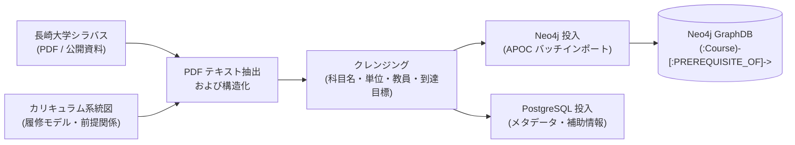

# Ingestion (データパイプライン & GraphRAG 構築バッチ)

本ディレクトリは、大学シラバス、カリキュラム系統図、および外部学習資源を収集・抽出し、**Neo4j（GraphDB）** および **PostgreSQL** へ投入・グラフ構造化するための独立したデータパイプライン（バッチ処理基盤）です。

---

## 1. 概要と位置づけ

### 1.1 アーキテクチャ上の責務 (ADR-0008)

常時稼働する Web API (`backend/`) とはライフサイクルおよびコンテナランタイム要件を完全に分離し、ルート直下の独立サービスとして配置されています。

- **Web API (`backend/`)**: Alpine Linux ベース。軽量・高速な同期 API サーバー（FastAPI + Agent）。
- **Ingestion (`ingestion/`)**: Debian ベース。PDF 解析、スクレイピング、テキスト抽出、および Neo4j APOC を用いた大規模バッチ投入を担うデータ基盤。

### 1.2 Phase 3 における注力方針: 長崎大学先行 Ingestion (ADR-0009)

本プロジェクトのロードマップ（Phase 3）に基づき、**長崎大学 情報データ科学部のカリキュラムマップおよび開講科目群** を最優先対象としてデータ構築を実施します。

- **目的**: 最速で実データに基づくエンドツーエンドのプロトタイプ検索アプリ（CourseNavi for Nagasaki University）を成立させ、学生サークルや学部生による実証インタビュー実験を行うこと。
- **対象データ**:
  - 長崎大学 情報データ科学部 開講科目のシラバス（PDF 形式）
  - 学部の履修系統図・カリキュラムマップ（前提条件ツリー、必修・選択区分）
- **設計上の配慮**: Phase 3 の段階では CS2023 オントロジーへのマッピングは行わず、実シラバスと大学内カリキュラム構造のグラフ化に集中します（CS2023 / Web教材マッピングは Phase 4 にて実施）。

---

## 2. ディレクトリ構成（想定）

```text
ingestion/
├── README.md               # 本ドキュメント
├── Dockerfile              # Python (Debian Slim) ベースのバッチコンテナ定義
├── pyproject.toml          # uv パッケージ管理設定 (pypdf, beautifulsoup4, neo4j 等)
├── uv.lock                 # 依存関係ロックファイル
├── data/                   # 収集元データおよび中間成果物
│   ├── raw/                # 取得した生 PDF / HTML シラバス
│   ├── parsed/             # 構造化抽出済み JSON / CSV データ
│   └── curriculum/         # カリキュラムマップ・履修系統図定義
└── src/
    ├── parsers/            # PDF / Web シラバス解析・テキストクレンジング
    │   └── nagasaki/       # 長崎大学 情報データ科学部用パーサー
    ├── graph/              # Neo4j 投入ロジック（APOC バッチインポート・Cypher）
    │   ├── schema.py       # ノード・リレーション定義
    │   └── loader.py       # Course, Prerequisite 等の一括ロード処理
    └── main.py             # Ingestion パイプライン実行エントリーポイント
```

---

## 3. データ処理フロー (Phase 3: Nagasaki Univ.)



1. **収集 (Extract)**: 長崎大学 情報データ科学部の公開シラバス PDF および履修系統図を取得。
2. **抽出・構造化 (Transform)**: 講義名、科目コード、開講期、単位数、担当教員、到達目標、講義計画、および前提履修条件をパース。
3. **グラフ構築 (Load)**:
   - `Course` ノードの生成（プロパティ: 科目コード、科目名、単位数、クレンジング済みシラバス本文等）
   - `PREREQUISITE_OF`（前提条件）、`BELONGS_TO`（学年・分野カテゴリ）リレーションの結合
   - Neo4j APOC プロシージャを活用したトランザクション制御と高速一括ロード

---

## 4. 実行方法（開発環境）

C 拡張ライブラリ（`asyncpg` 等）や PDF 解析ツールの環境差異を防ぐため、**Docker コンテナ内での実行を標準**としています。

### 前提条件: 共有ネットワークと DB の起動

```bash
# 共有ネットワークの作成（初回のみ）
docker network create gateway

# PostgreSQL / Neo4j の起動
docker compose -f db/compose.yaml up -d
```

### Docker 経由での実行（標準手順）

リポジトリルート直下から Docker Compose（`tools` プロファイル）経由で実行します。

```bash
# 1. コンテナイメージのビルド（初回および pyproject.toml / Dockerfile 更新時）
docker compose --profile tools build ingestion

# 2. 長崎大学シラバス等の公式 PDF 取得 (Fetcher)
docker compose --profile tools run --rm ingestion uv run python -m src.fetchers.nagasaki.fetch_data

# 3. PDF 解析・テキスト抽出・構造化 (Parser)(未実装)
docker compose --profile tools run --rm ingestion uv run python -m src.parsers.nagasaki.parser

# 4. Neo4j / PostgreSQL への一括投入パイプライン(未実装)
docker compose --profile tools run --rm ingestion uv run python -m src.main --target nagasaki
```

#### コンテナ内でインタラクティブに作業・デバッグする場合

```bash
# ingestion コンテナをバックグラウンド起動
docker compose --profile tools up -d ingestion

# コンテナ内シェルへ接続
docker compose exec ingestion bash

# （コンテナ内で実行）
uv run python -m src.parsers.nagasaki.parser
```

> [!NOTE]
> ローカルホスト（Windows等）上で直接 `uv run` を実行する場合、Python 3.14 用の C コンパイラ環境（Visual Studio C++ Build Tools 等）が必要になる場合があります。チーム開発時は上記の Docker コンテナ経由での実行を推奨します。

---

## 5. ロードマップと今後の展開

- [ ] **Phase 3（現在）**: 長崎大学 情報データ科学部 シラバス PDF のパーサー実装と Neo4j へのグラフ初期投入
- [ ] **Phase 3（現在）**: 前提科目ツリーおよび履修推奨エッジの結合検証
- [ ] **Phase 4（次期）**: ACM/IEEE CS2023 基準オントロジー投入パイプラインの実装
- [ ] **Phase 4（次期）**: LLM による学内科目 ↔ CS2023 オントロジーの自動推論マッピング (`[:MAPS_TO]`)
- [ ] **Phase 4（次期）**: Web 公開教材（OCW / MOOCs 等）の収集・グラフ化パイプラインの追加
