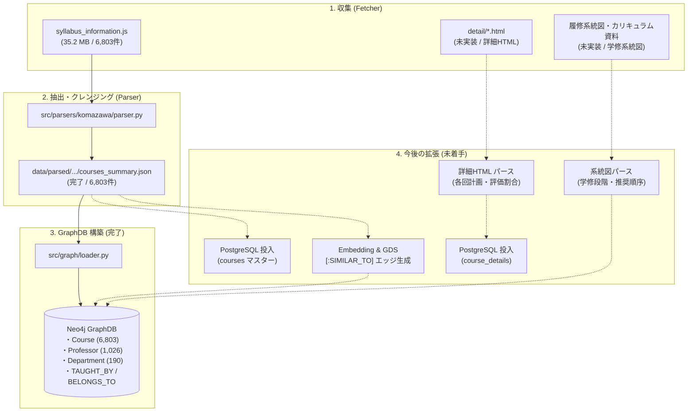

# Ingestion (データパイプライン & GraphRAG 構築バッチ)

本ディレクトリは、大学シラバス、カリキュラム系統図、および外部学習資源を収集・抽出し、**Neo4j（GraphDB）** および **PostgreSQL** へ投入・グラフ構造化するための独立したデータパイプライン（バッチ処理基盤）です。

---

## 1. 概要と位置づけ

### 1.1 アーキテクチャ上の責務 (ADR-0008)

常時稼働する Web API (`backend/`) とはライフサイクルおよびコンテナランタイム要件を完全に分離し、ルート直下の独立サービスとして配置されています。

- **Web API (`backend/`)**: Alpine Linux ベース。軽量・高速な同期 API サーバー（FastAPI + Agent）。
- **Ingestion (`ingestion/`)**: Debian ベース。PDF 解析、スクレイピング、テキスト抽出、および Neo4j APOC を用いた大規模バッチ投入を担うデータ基盤。

### 1.2 Phase 3 における注力方針: 駒澤大学 Ingestion へのピボット (ADR-0011)

> [!WARNING]
> **方針変更 (2026-10-08 / ADR-0011): 長崎大学 PDF 解析の一時停止と駒澤大学への切り替え**
> 長崎大学の専門科目シラバス PDF が学外非公開であることが判明したため、教養教育科目のみの PDF 解析は一時停止（凍結）としました。
> 代替として、開発メンバーのアクセス性とドメイン知識を活かせる **駒澤大学のシラバス・カリキュラムデータ** を対象とした Ingestion パイプラインの構築へピボットしています（詳細は [ADR-0011](../docs/adr/0011-pivot-from-nagasaki-to-komazawa-ingestion.md) を参照）。

- **目的**: 最速で実データに基づくエンドツーエンドのプロトタイプ検索アプリを成立させ、学生による実証インタビュー実験を行うこと。
- **対象データ**:
  - 駒澤大学 開講科目のシラバスおよびカリキュラム系統図
- **設計上の配慮**: Phase 3 の段階では CS2023 オントロジーへのマッピングは行わず、実シラバスと大学内カリキュラム構造のグラフ化に集中します（CS2023 / Web教材マッピングは Phase 4 にて実施）。

---

## 2. ディレクトリ構成（想定）

```text
ingestion/
├── README.md               # 本ドキュメント
├── Dockerfile              # Python (Debian Slim) ベースのバッチコンテナ定義
├── pyproject.toml          # uv パッケージ管理設定 (pypdf, beautifulsoup4, neo4j 等)
├── uv.lock                 # 依存関係ロックファイル
├── data/                   # 収集元データおよび中間成果物
│   ├── raw/                # 取得した生 PDF / HTML シラバス
│   ├── parsed/             # 構造化抽出済み JSON / CSV データ
│   └── curriculum/         # カリキュラムマップ・履修系統図定義
└── src/
    ├── fetchers/           # シラバス等の生データ収集
    │   ├── komazawa/       # 駒澤大学用フェッチャー (syllabus_information.js)
    │   └── nagasaki/       # 長崎大学用フェッチャー (PDF)
    ├── parsers/            # PDF / Web シラバス解析・テキストクレンジング
    │   ├── komazawa/       # 駒澤大学用パーサー
    │   └── nagasaki/       # 長崎大学用パーサー (一時停止)
    ├── graph/              # Neo4j 投入ロジック（APOC バッチインポート・Cypher）
    │   ├── schema.py       # ノード・リレーション定義
    │   └── loader.py       # Course, Prerequisite 等の一括ロード処理
    └── main.py             # Ingestion パイプライン実行エントリーポイント
```

---

---

## 3. 実装状況サマリー (Status & Progress)

### 3.1 できている点 (Completed)

* **[Extract] 概要データの一括取得 (Fetcher)**:
  * [`src/fetchers/komazawa/fetch_data.py`](src/fetchers/komazawa/fetch_data.py)
  * `syllabus_information.js`（約35.2MB、全6,803科目）をストリーミングで安定ダウンロード。
  * べき等性（ダウンロード済みファイルのスキップ）および強制再取得フラグ（`--force`）を完備。
* **[Transform] 構造化解析・クレンジング (Parser)**:
  * [`src/parsers/komazawa/parser.py`](src/parsers/komazawa/parser.py)
  * 文字列内の制御文字（生改行・タブ等）に対応した安全な JSON パース（`strict=False`）。
  * `subject` テキストから **カナ読み、開講期（通年/前期/後期）、単位数、開講曜日、時限、教員カナ** を動的に抽出。
  * 全角スペースや連続空行のサニタイズ（全6,803件パース成功、エラー0件）。
* **[Load] ベース Graph の一括構築 (Graph Loader)**:
  * [`src/graph/loader.py`](src/graph/loader.py), [`src/graph/schema.py`](src/graph/schema.py)
  * `Course.code`, `Professor.name`, `Department.name` の一意制約（`CREATE CONSTRAINT`）の自動適用。
  * `UNWIND $batch`（1,000件単位）による一括 MERGE により、**8.66秒で全6,803件の投入完了**。
  * ノード: `Course` (6,803件), `Professor` (1,026件), `Department` (190件)
  * エッジ: `[:TAUGHT_BY]` (6,803件), `[:BELONGS_TO]` (6,803件)
* **[Quality] テストの完備**:
  * モックを活用した単体テスト（全22件）が Docker コンテナ内で 100% 通過。

### 3.2 出来ていない点・今後の課題 (Pending / To-Do)

* **PostgreSQL への永続化 (RDB Ingestion)**:
  * PostgreSQL 側の `courses` テーブル（マスターデータ）への一括投入スクリプトの実装（`asyncpg` 利用）。
* **詳細データの取り込み (HTML Parser / Detail Fetcher)**:
  * 個別詳細HTML（`detail/{rishu_code}.html`）のバッチ収集。
  * 第1回〜第15回の授業計画、評価方法の内訳（定期試験〇%、レポート〇%等）、教科書・参考書の表組み構造のパース。
  * RDB（`course_details` テーブル / JSONB）への格納。
* **履修系統図（カリキュラムツリー・学修系統図）との関係性の紐付け**:
  * 学部・学科ごとの履修系統図（PDF / 公開資料）の収集・構造化。
  * 学修段階（基礎・基幹・展開・発展）や学年配当、必修・選択区分ノードの生成と、シラバス科目とのリレーション接続 (`[:PART_OF_CURRICULUM]`, `[:RECOMMENDED_BEFORE]`)。
* **前提科目エッジ (`[:REQUIRES_PREREQUISITE]`) の構築**:
  * シラバス本文やカリキュラム資料から「〇〇履修済み」等の前提条件を抽出し、科目間エッジを接続。
* **GDS (Graph Data Science) によるセマンティック類似度エッジ (`[:SIMILAR_TO]`) の生成**:
  * 科目テキスト（`text`）の Embedding（ベクトル埋め込み）生成。
  * Neo4j Vector Index の作成。
  * Neo4j GDS（kNN / Node Similarity 等）を用いた `[:SIMILAR_TO {score: ...}]` エッジの自動導出。
* **CS2023 オントロジー統合 (Phase 4)**:
  * ACM/IEEE CS2023 基準オントロジーノード群の投入と、学内科目との自動推論マッピング (`[:MAPS_TO]`)。

---

## 4. データ処理フロー (Komazawa Univ.)


```mermaid
flowchart TD
    subgraph Extract["1. 収集 (Fetcher)"]
        RawJS["syllabus_information.js<br/>(35.2 MB / 6,803件)"]
        RawHTML["detail/*.html<br/>(未実装 / 詳細HTML)"]
        RawTree["履修系統図・カリキュラム資料<br/>(未実装 / 学修系統図)"]
    end

    subgraph Transform["2. 抽出・クレンジング (Parser)"]
        Parser["src/parsers/komazawa/parser.py"]
        RawJS --> Parser
        SummaryJSON["data/parsed/.../courses_summary.json<br/>(完了 / 6,803件)"]
        Parser --> SummaryJSON
    end

    subgraph LoadGraph["3. GraphDB 構築 (完了)"]
        SummaryJSON --> Loader["src/graph/loader.py"]
        Loader --> Neo4j[("Neo4j GraphDB<br/>・Course (6,803)<br/>・Professor (1,026)<br/>・Department (190)<br/>・TAUGHT_BY / BELONGS_TO")]
    end

    subgraph Pending["4. 今後の拡張 (未着手)"]
        SummaryJSON -.-> LoadPG["PostgreSQL 投入<br/>(courses マスター)"]
        RawHTML -.-> DetailParser["詳細HTML パース<br/>(各回計画・評価割合)"]
        DetailParser -.-> PG_Detail["PostgreSQL 投入<br/>(course_details)"]
        RawTree -.-> TreeParser["系統図パース<br/>(学修段階・推奨順序)"]
        TreeParser -.-> Neo4j
        SummaryJSON -.-> Embed["Embedding & GDS<br/>[:SIMILAR_TO] エッジ生成"]
        Embed -.-> Neo4j
    end
```

---

## 5. 実行方法（開発環境）

C 拡張ライブラリ（`asyncpg` 等）や PDF 解析ツールの環境差異を防ぐため、**Docker コンテナ内での実行を標準**としています。

### 前提条件: 共有ネットワークと DB の起動

```bash
# 共有ネットワークの作成（初回のみ）
docker network create gateway

# PostgreSQL / Neo4j の起動
docker compose -f db/compose.yaml up -d
```

### Docker 経由での実行（標準手順）

リポジトリルート直下から Docker Compose（`tools` プロファイル）経由で実行します。

```bash
# 1. コンテナイメージのビルド（初回および pyproject.toml / Dockerfile 更新時）
docker compose --profile tools build ingestion

# 2. シラバス等の公式データ取得 (Fetcher)
# 駒澤大学（全科目静的インデックス取得）
docker compose --profile tools run --rm ingestion uv run python -m src.fetchers.komazawa.fetch_data

# （参考）長崎大学（一時停止中）
docker compose --profile tools run --rm ingestion uv run python -m src.fetchers.nagasaki.fetch_data

# 3. 解析・テキスト抽出・構造化 (Parser)
docker compose --profile tools run --rm ingestion uv run python -m src.parsers.komazawa.parser

# 4. Neo4j へのベースグラフ一括投入 (Graph Loader: Course, Professor, Department)
docker compose --profile tools run --rm ingestion uv run python -m src.graph.loader
```

#### コンテナ内でインタラクティブに作業・デバッグする場合

```bash
# ingestion コンテナをバックグラウンド起動
docker compose --profile tools up -d ingestion

# コンテナ内シェルへ接続
docker compose exec ingestion bash

# （コンテナ内で実行）
uv run python -m src.parsers.komazawa.parser
```

> [!NOTE]
> ローカルホスト（Windows等）上で直接 `uv run` を実行する場合、Python 3.14 用の C コンパイラ環境（Visual Studio C++ Build Tools 等）が必要になる場合があります。チーム開発時は上記の Docker コンテナ経由での実行を推奨します。

---

## 6. ロードマップと今後の展開

- [x] **Phase 3（現在）**: 駒澤大学 シラバスおよびカリキュラムデータの Ingestion 実装と Neo4j へのグラフ初期投入（完了: 6,803件 / ADR-0011）
- [ ] **Phase 3（現在）**: 前提科目ツリーおよび履修推奨エッジの結合検証
- [ ] **Phase 4（次期）**: ACM/IEEE CS2023 基準オントロジー投入パイプラインの実装
- [ ] **Phase 4（次期）**: LLM による学内科目 ↔ CS2023 オントロジーの自動推論マッピング (`[:MAPS_TO]`)
- [ ] **Phase 4（次期）**: Web 公開教材（OCW / MOOCs 等）の収集・グラフ化パイプラインの追加
